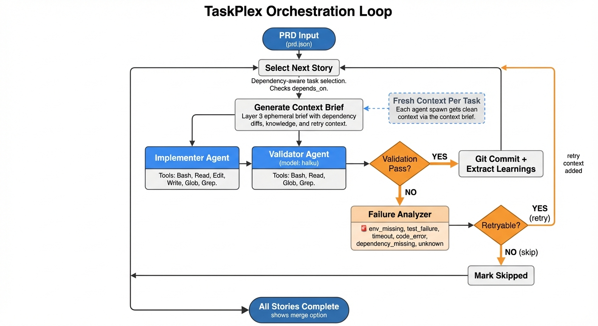
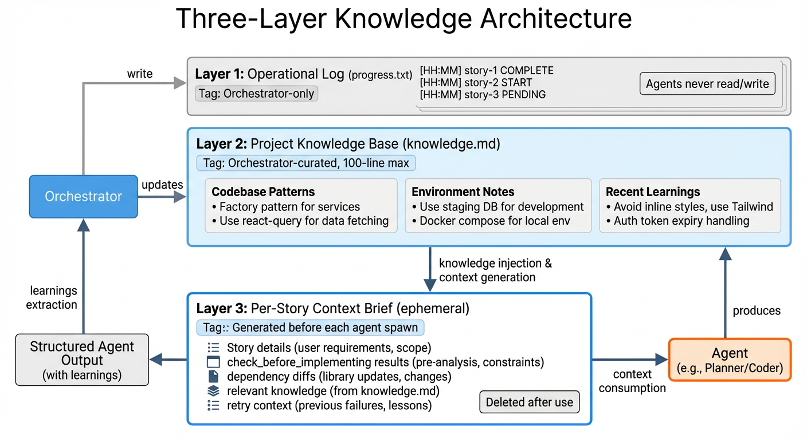

# TaskPlex

[](https://github.com/flight505/taskplex)
[](LICENSE)
[](https://github.com/anthropics/claude-code)

Resilient autonomous development assistant with custom subagents, error categorization, and a three-layer knowledge architecture that learns as it builds.

Successor to [SDK Bridge](https://github.com/flight505/sdk-bridge). Based on [Geoffrey Huntley's Ralph pattern](https://ghuntley.com/ralph/).

---

## How It Works

<p align="center">
  
</p>

TaskPlex runs a **bash orchestration loop** that spawns fresh Claude subagents for each story. Each agent gets a clean context window with a targeted **context brief** — no context pollution, no accumulated hallucinations.

The loop continues until all stories pass validation or max iterations are reached.

---

## Features

**Custom Subagents** — Purpose-built agents with restricted tools and right-sized models replace monolithic `claude -p` calls.

**Error Categorization & Retry** — Failed tasks are classified (env_missing, test_failure, code_error, etc.) with intelligent retry/skip decisions and max retry limits.

**Three-Layer Knowledge** — Operational log, curated knowledge base, and ephemeral context briefs ensure each agent gets exactly the context it needs.

**Dependency-Aware Execution** — Stories declare `depends_on` and `related_to` relationships. The orchestrator enforces execution order and injects dependency diffs into context briefs.

**Quality Gate Hooks** — PostToolUse hooks block destructive git commands (`push --force`, `reset --hard`, direct push to main) during implementation.

**Already-Implemented Detection** — Agents search for existing implementation before coding. If all acceptance criteria are already met, the story is marked complete in seconds.

---

## Quick Start

### Prerequisites

- [Claude Code CLI](https://code.claude.com)
- `jq` JSON parser (`brew install jq` on macOS)
- Git repository for your project
- Authentication (OAuth token or API key)

### Installation

```bash
# Add marketplace
/plugin marketplace add flight505/flight505-marketplace

# Install plugin
/plugin install taskplex@flight505-marketplace
```

### Run

```bash
/taskplex:start
```

TaskPlex will guide you through a 7-checkpoint interactive wizard:

1. **Dependency check** — verifies `claude`, `jq`, and `coreutils`
2. **Project input** — describe your feature or provide a file path
3. **Generate PRD** — creates structured PRD with clarifying questions
4. **Review PRD** — approve, suggest improvements, or edit manually
5. **Convert to JSON** — transforms PRD to executable `prd.json` with dependency inference
6. **Execution settings** — iterations, timeout, model, foreground/background
7. **Launch** — starts the autonomous orchestration loop

---

## Knowledge Architecture

<p align="center">
  
</p>

TaskPlex uses a three-layer system to manage knowledge across agent spawns:

### Layer 1: Operational Log (`progress.txt`)

Orchestrator-only. Compact timestamped entries tracking story lifecycle events. Agents never read or write this file.

```
[14:32] story-1 START
[14:45] story-1 COMPLETE (learnings extracted)
[14:45] story-2 START
[14:52] story-2 FAIL (test_failure, retry 1/2)
```

### Layer 2: Project Knowledge Base (`knowledge.md`)

Orchestrator-curated. After each story, the orchestrator extracts `learnings` from the agent's structured output and appends them here. Sections: **Codebase Patterns**, **Environment Notes**, **Recent Learnings**. Capped at 100 lines with oldest-entry trimming.

### Layer 3: Per-Story Context Brief (ephemeral)

Generated before each agent spawn. Contains:
- Story details and acceptance criteria
- `check_before_implementing` results (grep output)
- Git diffs from dependency stories
- Relevant entries from `knowledge.md`
- Retry context (if retrying a failed story)

Deleted after use. This is the bridge between persistent knowledge and fresh agent context.

---

## Custom Agents

| Agent | Model | Tools | Purpose |
|-------|-------|-------|---------|
| **implementer** | inherit | Bash, Read, Edit, Write, Glob, Grep | Code a single story with structured output |
| **validator** | haiku | Bash, Read, Glob, Grep | Verify acceptance criteria (read-only) |
| **reviewer** | sonnet | Read, Glob, Grep | Review PRD quality from specific angles |
| **merger** | haiku | Bash, Read, Grep | Git branch lifecycle (create, merge, cleanup) |

Each agent follows the **principle of least privilege** — only the tools needed for its specific role.

---

## Error Handling

When a task fails, the **failure-analyzer** skill classifies the error and recommends a retry strategy:

| Category | Retryable | Max Retries | Action |
|----------|-----------|-------------|--------|
| `env_missing` | No | 0 | Skip, log for user |
| `test_failure` | Yes | 2 | Retry with test output as context |
| `timeout` | Yes | 1 | Retry with 1.5x timeout |
| `code_error` | Yes | 2 | Retry with error output as context |
| `dependency_missing` | No | 0 | Skip, log for user |
| `unknown` | Once | 1 | Retry once, then skip |

Non-retryable errors are skipped immediately so the loop continues making progress on other stories.

---

## Configuration

After first run, edit `.claude/taskplex.config.json`:

```json
{
  "max_iterations": 25,
  "iteration_timeout": 3600,
  "execution_mode": "foreground",
  "execution_model": "opus",
  "effort_level": "high",
  "branch_prefix": "taskplex",
  "max_retries_per_story": 2,
  "max_turns": 200,
  "merge_on_complete": false,
  "test_command": "",
  "build_command": "",
  "typecheck_command": ""
}
```

| Field | Default | Description |
|-------|---------|-------------|
| `max_iterations` | 25 | Stop after N iterations (1 story ~ 1-3 iterations) |
| `iteration_timeout` | 3600 | Timeout per iteration in seconds |
| `execution_mode` | foreground | `foreground` (interactive) or `background` (autonomous) |
| `execution_model` | opus | `sonnet` or `opus` for story implementation |
| `effort_level` | high | Opus 4.6 reasoning depth: `low`, `medium`, `high` |
| `branch_prefix` | taskplex | Git branch prefix |
| `max_retries_per_story` | 2 | Max retry attempts before skipping |
| `max_turns` | 200 | Max agentic turns per Claude invocation |
| `merge_on_complete` | false | Auto-merge to main when all stories pass |
| `test_command` | — | Project test command (e.g., `npm test`) |
| `build_command` | — | Project build command (e.g., `npm run build`) |
| `typecheck_command` | — | Project typecheck command (e.g., `tsc --noEmit`) |

**Model selection:**
- **Opus 4.6 (high effort)**: Best code quality, deepest reasoning
- **Opus 4.6 (medium effort)**: Best cost/quality balance
- **Opus 4.6 (low effort)**: Fastest, minimal reasoning
- **Sonnet 4.5**: Fast and efficient, good for most tasks

---

## Authentication

TaskPlex supports two methods with automatic fallback:

**OAuth Token (Recommended for Max subscribers):**
```bash
claude setup-token
export CLAUDE_CODE_OAUTH_TOKEN='your-token'
```

**API Key (Alternative):**
```bash
export ANTHROPIC_API_KEY='your-key'
```

OAuth is used when available, with automatic fallback to API key.

---

## Key Files

| File | Purpose |
|------|---------|
| `prd.json` | Task list with execution status (source of truth) |
| `tasks/prd-*.md` | Human-readable PRD |
| `progress.txt` | Operational log (orchestrator-only) |
| `knowledge.md` | Curated project knowledge base |
| `.claude/taskplex.config.json` | Configuration |

---

## Foreground vs Background

**Foreground (default):**
- Live output as agents work
- Interactive timeout prompts (skip/retry/abort)
- Stop with Ctrl+C (graceful cleanup)

**Background:**
- Run autonomously while you work
- Monitor: `tail -f .claude/taskplex.log`
- Auto-skip on timeout
- Stop: `kill $(cat .claude/taskplex-{branch}.pid)`

---

## Debugging

```bash
# See which stories are done
cat prd.json | jq '.userStories[] | {id, title, passes}'

# View knowledge base
cat knowledge.md

# Check operational log
cat progress.txt

# Monitor live (background mode)
tail -f .claude/taskplex.log

# Check git history
git log --oneline -10
```

---

## What Changed from SDK Bridge?

TaskPlex is a **next-generation rewrite** of SDK Bridge with:

- **Custom subagents** replace monolithic `claude -p` calls — each agent has restricted tools and a right-sized model
- **Error categorization** with intelligent retry/skip decisions (6 error categories)
- **Three-layer knowledge architecture** — operational log, curated knowledge base, ephemeral context briefs
- **Structured agent output** with learnings extraction, per-AC results, and retry hints
- **Dependency-aware execution** with enforced ordering and dependency diffs
- **Quality gate hooks** blocking destructive git commands during implementation
- **JSON configuration** replacing YAML frontmatter

---

## References

- [Claude Code CLI](https://code.claude.com/docs/en/cli-reference.md)
- [Claude Code Subagents](https://code.claude.com/docs/en/sub-agents.md)
- [Claude Code Hooks](https://code.claude.com/docs/en/hooks.md)
- [Geoffrey Huntley's Ralph](https://ghuntley.com/ralph/)
- [Plugin Development Guide](https://github.com/anthropics/claude-code/blob/main/docs/plugins.md)

---

## License

MIT © [Jesper Vang](https://github.com/flight505)
