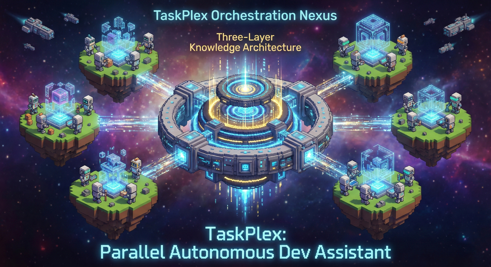

# TaskPlex

<p align="center">
  
</p>

[](https://github.com/flight505/taskplex)
[](LICENSE)
[](https://github.com/anthropics/claude-code)

Resilient autonomous development assistant with Smart Scaffold intelligence: 1-shot decision calls for per-story model routing, SubagentStart/Stop hooks for context injection and inline validation, SQLite knowledge store with confidence decay, and wave-based parallel execution via git worktrees.

Successor to [SDK Bridge](https://github.com/flight505/sdk-bridge). Based on [Geoffrey Huntley's Ralph pattern](https://ghuntley.com/ralph/).

---

## How It Works

<p align="center">
  
</p>

TaskPlex runs a **bash orchestration loop** that spawns fresh Claude subagents for each story. A **1-shot decision call** picks the optimal model and effort level per story. The **SubagentStart hook** injects context from the SQLite knowledge store, and the **SubagentStop hook** runs inline validation with agent self-healing.

The loop continues until all stories pass validation or max iterations are reached.

---

## Features

**Decision Calls** (v2.0) — 1-shot Opus call per story picks the optimal model (haiku/sonnet/opus) and effort level based on story complexity, error history, and codebase patterns. ~$0.03/story overhead.

**SubagentStart Hook** (v2.0) — Automatically queries the SQLite knowledge store and injects context (learnings, error history, dependency diffs, pre-implementation checks) into each agent spawn. Replaces manual context brief generation.

**Inline Validation & Self-Healing** (v2.0) — SubagentStop hook runs typecheck/build/test after each agent finishes. If validation fails, the agent is blocked and continues fixing in the same session — no iteration wasted.

**SQLite Knowledge Store** (v2.0) — Persistent storage for learnings, errors, decisions, and runs. Confidence decay at 5%/day ensures stale knowledge auto-expires. Auto-migrates from `knowledge.md` on first run.

**Custom Subagents** — Purpose-built agents with restricted tools and right-sized models replace monolithic `claude -p` calls.

**Error Categorization & Retry** — Failed tasks are classified (env_missing, test_failure, code_error, etc.) with intelligent retry/skip decisions and max retry limits.

**Dependency-Aware Execution** — Stories declare `depends_on` and `related_to` relationships. The orchestrator enforces execution order and injects dependency diffs.

**Quality Gate Hooks** — PostToolUse hooks block destructive git commands (`push --force`, `reset --hard`, direct push to main) during implementation.

**Already-Implemented Detection** — Agents search for existing implementation before coding. If all acceptance criteria are already met, the story is marked complete in seconds.

**Parallel Execution via Worktrees** (v1.2) — Independent stories run simultaneously in separate git worktrees, partitioned into waves based on the dependency graph. Opt-in with `parallel_mode: "parallel"`.

---

## Parallel Execution (v1.2)

TaskPlex can run independent stories in parallel using git worktrees. Stories are grouped into **waves** based on the dependency graph:

```
Wave 0: [US-001, US-005]  <- no dependencies, run in parallel
         | merge both | extract learnings | update knowledge.md
Wave 1: [US-002, US-003]  <- deps on wave 0, run in parallel
         | merge all | extract learnings | update knowledge.md
Wave 2: [US-004]           <- deps on wave 1
```

### Enable Parallel Mode

Set in `.claude/taskplex.config.json`:

```json
{
  "parallel_mode": "parallel",
  "max_parallel": 3,
  "worktree_setup_command": "npm install",
  "conflict_strategy": "abort"
}
```

Or select "Parallel" during the interactive wizard (Checkpoint 6).

### How It Works

1. **Wave computation** — stories are partitioned into topological levels based on `depends_on`
2. **Conflict splitting** — stories sharing `related_to` targets are separated into different batches
3. **Worktree creation** — each story gets its own git worktree with a dedicated branch
4. **Parallel agents** — Claude agents run simultaneously in separate worktrees
5. **Sequential merge** — completed story branches merge back into the feature branch in priority order
6. **Knowledge propagation** — learnings from all wave stories update `knowledge.md` before the next wave

### Safety

- Stories that depend on each other are **never** in the same wave
- Stories sharing `related_to` targets are split into separate batches (prevents merge conflicts)
- Failed stories are deferred to the next wave (get updated knowledge from successful stories)
- `Ctrl+C` cleanly removes all worktrees and kills all parallel agents
- Default `parallel_mode: "sequential"` preserves v1.1 behavior exactly

---

## Quick Start

### Prerequisites

- [Claude Code CLI](https://code.claude.com)
- `jq` JSON parser (`brew install jq` on macOS)
- Git repository for your project
- Authentication (OAuth token or API key)

### Installation

```bash
# Add marketplace
/plugin marketplace add flight505/flight505-marketplace

# Install plugin
/plugin install taskplex@flight505-marketplace
```

### Run

```bash
/taskplex:start
```

TaskPlex will guide you through a 7-checkpoint interactive wizard:

1. **Dependency check** — verifies `claude`, `jq`, and `coreutils`
2. **Project input** — describe your feature or provide a file path
3. **Generate PRD** — creates structured PRD with clarifying questions
4. **Review PRD** — approve, suggest improvements, or edit manually
5. **Convert to JSON** — transforms PRD to executable `prd.json` with dependency inference
6. **Execution settings** — iterations, timeout, model, foreground/background
7. **Launch** — starts the autonomous orchestration loop

---

## Smart Scaffold Knowledge Architecture (v2.0)

<p align="center">
  
</p>

TaskPlex uses a three-layer system with SQLite-backed persistence and hook-based context injection:

### Layer 1: Operational Log (`progress.txt`)

Orchestrator-only. Compact timestamped entries tracking story lifecycle events. Agents never read or write this file.

### Layer 2: SQLite Knowledge Store (`knowledge.db`)

Five tables with automatic confidence decay (5%/day — stale learnings expire after ~30 days):
- **learnings** — codebase patterns and conventions extracted from agent output
- **error_history** — categorized errors with resolution tracking
- **decisions** — per-story decision call results (action, model, effort)
- **file_patterns** — discovered file conventions
- **runs** — execution lifecycle tracking

Auto-migrates from `knowledge.md` on first run (one-time, idempotent).

### Layer 3: Hook-Based Context Injection

The **SubagentStart hook** (`inject-knowledge.sh`) automatically queries SQLite and injects into each agent:
- Story details and acceptance criteria
- `check_before_implementing` results (grep output)
- Git diffs from dependency stories
- Relevant learnings from knowledge store
- Error history and retry context

The **SubagentStop hook** (`validate-result.sh`) runs typecheck/build/test after each agent finishes. If validation fails, the agent is blocked (exit 2) and self-heals in the same session.

---

## Custom Agents

| Agent | Model | Tools | Purpose |
|-------|-------|-------|---------|
| **implementer** | inherit | Bash, Read, Edit, Write, Glob, Grep | Code a single story with structured output |
| **validator** | haiku | Bash, Read, Glob, Grep | Verify acceptance criteria (read-only) |
| **reviewer** | sonnet | Read, Glob, Grep | Review PRD quality from specific angles |
| **merger** | haiku | Bash, Read, Grep | Git branch lifecycle (create, merge, cleanup) |

Each agent follows the **principle of least privilege** — only the tools needed for its specific role.

---

## Error Handling

When a task fails, the **failure-analyzer** skill classifies the error and recommends a retry strategy:

| Category | Retryable | Max Retries | Action |
|----------|-----------|-------------|--------|
| `env_missing` | No | 0 | Skip, log for user |
| `test_failure` | Yes | 2 | Retry with test output as context |
| `timeout` | Yes | 1 | Retry with 1.5x timeout |
| `code_error` | Yes | 2 | Retry with error output as context |
| `dependency_missing` | No | 0 | Skip, log for user |
| `unknown` | Once | 1 | Retry once, then skip |

Non-retryable errors are skipped immediately so the loop continues making progress on other stories.

---

## Configuration

After first run, edit `.claude/taskplex.config.json`:

```json
{
  "max_iterations": 25,
  "iteration_timeout": 3600,
  "execution_mode": "foreground",
  "execution_model": "opus",
  "effort_level": "high",
  "branch_prefix": "taskplex",
  "max_retries_per_story": 2,
  "max_turns": 200,
  "merge_on_complete": false,
  "test_command": "",
  "build_command": "",
  "typecheck_command": "",
  "parallel_mode": "sequential",
  "max_parallel": 3,
  "worktree_dir": "",
  "worktree_setup_command": "",
  "conflict_strategy": "abort",
  "decision_calls": true,
  "decision_model": "opus",
  "knowledge_db": "knowledge.db",
  "validate_on_stop": true,
  "model_routing": "auto"
}
```

| Field | Default | Description |
|-------|---------|-------------|
| `max_iterations` | 25 | Stop after N iterations (1 story ~ 1-3 iterations) |
| `iteration_timeout` | 3600 | Timeout per iteration in seconds |
| `execution_mode` | foreground | `foreground` (interactive) or `background` (autonomous) |
| `execution_model` | opus | `sonnet` or `opus` for story implementation |
| `effort_level` | high | Opus 4.6 reasoning depth: `low`, `medium`, `high` |
| `branch_prefix` | taskplex | Git branch prefix |
| `max_retries_per_story` | 2 | Max retry attempts before skipping |
| `max_turns` | 200 | Max agentic turns per Claude invocation |
| `merge_on_complete` | false | Auto-merge to main when all stories pass |
| `test_command` | — | Project test command (e.g., `npm test`) |
| `build_command` | — | Project build command (e.g., `npm run build`) |
| `typecheck_command` | — | Project typecheck command (e.g., `tsc --noEmit`) |
| `parallel_mode` | sequential | `sequential` or `parallel` (worktree-based) |
| `max_parallel` | 3 | Max concurrent agents per wave batch |
| `worktree_dir` | — | Custom worktree base directory (default: `../.worktrees`) |
| `worktree_setup_command` | — | Command run in each new worktree (e.g., `npm install`) |
| `conflict_strategy` | abort | `abort` (skip on conflict) or `merger` (invoke merger agent) |
| `decision_calls` | true | Enable 1-shot decision calls per story (~$0.03/story) |
| `decision_model` | opus | Model for decision calls |
| `knowledge_db` | knowledge.db | SQLite knowledge store path |
| `validate_on_stop` | true | Enable SubagentStop inline validation |
| `model_routing` | auto | `auto` (decision call picks) or `fixed` (use execution_model) |

**Model selection:**
- **Opus 4.6 (high effort)**: Best code quality, deepest reasoning
- **Opus 4.6 (medium effort)**: Best cost/quality balance
- **Opus 4.6 (low effort)**: Fastest, minimal reasoning
- **Sonnet 4.5**: Fast and efficient, good for most tasks

---

## Authentication

TaskPlex supports two methods with automatic fallback:

**OAuth Token (Recommended for Max subscribers):**
```bash
claude setup-token
export CLAUDE_CODE_OAUTH_TOKEN='your-token'
```

**API Key (Alternative):**
```bash
export ANTHROPIC_API_KEY='your-key'
```

OAuth is used when available, with automatic fallback to API key.

---

## Key Files

| File | Purpose |
|------|---------|
| `prd.json` | Task list with execution status (source of truth) |
| `tasks/prd-*.md` | Human-readable PRD |
| `progress.txt` | Operational log (orchestrator-only) |
| `knowledge.db` | SQLite knowledge store (v2.0 — replaces knowledge.md) |
| `.claude/taskplex.config.json` | Configuration |

---

## Foreground vs Background

**Foreground (default):**
- Live output as agents work
- Interactive timeout prompts (skip/retry/abort)
- Stop with Ctrl+C (graceful cleanup)

**Background:**
- Run autonomously while you work
- Monitor: `tail -f .claude/taskplex.log`
- Auto-skip on timeout
- Stop: `kill $(cat .claude/taskplex-{branch}.pid)`

---

## Debugging

```bash
# See which stories are done
cat prd.json | jq '.userStories[] | {id, title, passes}'

# View knowledge base
cat knowledge.md

# Check operational log
cat progress.txt

# Monitor live (background mode)
tail -f .claude/taskplex.log

# Check git history
git log --oneline -10
```

---

## What Changed from SDK Bridge?

TaskPlex is a **next-generation rewrite** of SDK Bridge with:

- **Smart Scaffold intelligence** (v2.0) — 1-shot decision calls, SQLite knowledge store, hook-based context injection, inline validation with self-healing
- **Model routing** (v2.0) — decision call picks haiku/sonnet/opus per story based on complexity and error history
- **SubagentStart/Stop hooks** (v2.0) — automatic context injection and inline validation replace manual flows
- **Custom subagents** — purpose-built agents with restricted tools and right-sized models
- **Error categorization** with intelligent retry/skip decisions (6 error categories)
- **SQLite knowledge store** with confidence decay, error tracking, and decision history
- **Structured agent output** with learnings extraction, per-AC results, and retry hints
- **Dependency-aware execution** with enforced ordering and dependency diffs
- **Quality gate hooks** blocking destructive git commands during implementation
- **Wave-based parallel execution** (v1.2) — independent stories run simultaneously in git worktrees

---

## References

- [Claude Code CLI](https://code.claude.com/docs/en/cli-reference.md)
- [Claude Code Subagents](https://code.claude.com/docs/en/sub-agents.md)
- [Claude Code Hooks](https://code.claude.com/docs/en/hooks.md)
- [Geoffrey Huntley's Ralph](https://ghuntley.com/ralph/)
- [Plugin Development Guide](https://github.com/anthropics/claude-code/blob/main/docs/plugins.md)

---

## License

MIT © [Jesper Vang](https://github.com/flight505)
