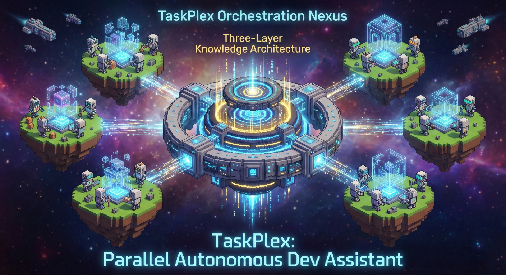
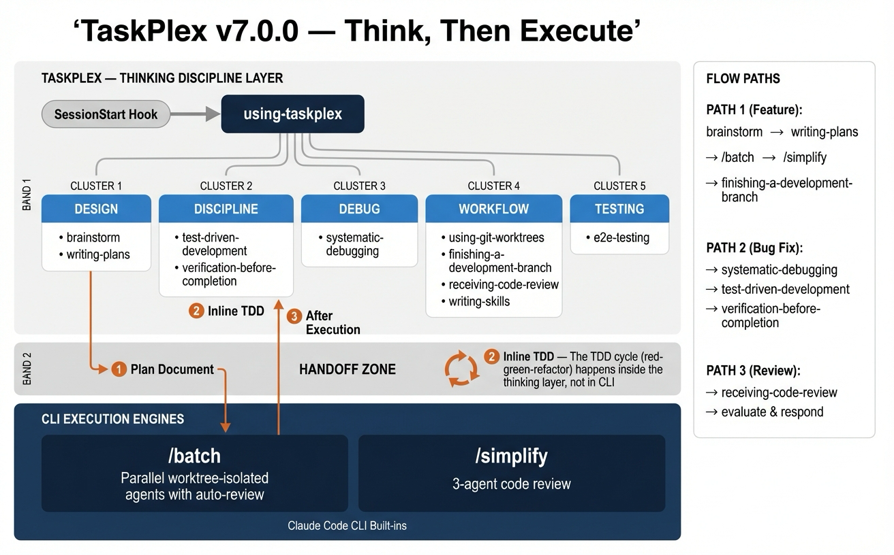

# TaskPlex

<p align="center">
  
</p>

[](https://github.com/flight505/taskplex)
[](LICENSE)
[](https://github.com/anthropics/claude-code)

Always-on development companion for Claude Code. TDD enforcement, verification gates, systematic debugging, E2E testing, and disciplined workflows — powered by pure-markdown skills and zero runtime dependencies. Execution handled by CLI built-ins (`/batch`, `/simplify`).

**For complete projects and long-running builds:** Use [SDK-Bridge](https://github.com/flight505/sdk-bridge).

---

## How It Works

<p align="center">
  
</p>

> **Reading the diagram:** A `SessionStart` hook activates the **using-taskplex** routing gate every session. It inspects what you're doing and routes to the right **skill cluster** — five groups of related skills: *Design* (brainstorm, writing-plans), *Discipline* (TDD, verification), *Debug* (systematic-debugging), *Workflow* (worktrees, branch finishing, code review, skill authoring), and *Testing* (e2e-testing). The three orange handoff indicators show how work flows between TaskPlex and the CLI: **①** a plan document produced by the Design cluster is handed to `/batch` for parallel execution, **②** the Inline TDD cycle (red → green → refactor) loops entirely within the Discipline cluster without leaving the thinking layer, and **③** after `/batch` or `/simplify` finishes, results flow back up to verification-before-completion for evidence-based sign-off. The **Flow Paths** panel on the right shows three common end-to-end journeys through the system.

TaskPlex activates automatically — no explicit invocation needed. It is the **thinking discipline layer**: it prepares the work (brainstorm, plan, TDD) so the CLI execution engines (`/batch`, `/simplify`) produce better results.

**Shortcuts for common workflows:**

| Command | Skill | When |
|---------|-------|------|
| `/brainstorm` | brainstorm | Before creating anything new (invoked directly as skill) |
| `/write-plan` | writing-plans | Need a task-by-task plan |
| `/e2e-test` | e2e-testing | Systematic end-to-end testing of your application |

**After planning, execute with CLI:**
- `/batch` — Parallel worktree-isolated agents with auto-review
- `/simplify` — 3-agent code review

---

## Skills (11)

| Skill | Triggers When |
|-------|--------------|
| **brainstorm** | New feature described, before implementation |
| **test-driven-development** | Before any implementation |
| **verification-before-completion** | Before claiming work is done |
| **systematic-debugging** | Bug, test failure, or unexpected behavior |
| **using-git-worktrees** | Feature work needs isolation |
| **finishing-a-development-branch** | Ready to integrate |
| **receiving-code-review** | Responding to review feedback |
| **writing-plans** | Need detailed task-by-task plan |
| **writing-skills** | Creating or editing skills |
| **using-taskplex** | Always-on routing gate |
| **e2e-testing** | User invokes `/e2e-test` for systematic journey testing |

---

## Quick Start

### Prerequisites

- [Claude Code CLI](https://code.claude.com)
- Git repository

### Installation

```bash
# Add marketplace
/plugin marketplace add flight505/flight505-marketplace

# Install plugin
/plugin install taskplex@flight505-marketplace
```

### Usage

**Proactive (recommended):** Just start working. TaskPlex activates automatically when it detects relevant context.

**Explicit:** Use the shortcut commands:
- `/brainstorm` — Explore requirements before jumping to code
- `/write-plan` — Create a detailed implementation plan
- `/e2e-test` — Research all user journeys, then test every path with evidence

**Execute plans:** Use `/batch` (CLI built-in) to run tasks in parallel worktrees.

---

## Architecture

```
taskplex/
├── .claude-plugin/plugin.json     # v7.0.4
├── commands/                      # 2 shortcuts
│   ├── write-plan.md
│   └── e2e-test.md
├── hooks/                         # 1 hook (SessionStart)
│   ├── hooks.json
│   ├── run-hook.cmd
│   └── session-start
└── skills/                        # 11 skills
    ├── brainstorm/
    ├── test-driven-development/
    ├── verification-before-completion/
    ├── systematic-debugging/
    ├── using-git-worktrees/
    ├── finishing-a-development-branch/
    ├── receiving-code-review/
    ├── writing-plans/
    ├── writing-skills/
    ├── using-taskplex/
    └── e2e-testing/
```

| Component | Count | Notes |
|-----------|-------|-------|
| Skills | 11 | Discipline patterns (TDD, debugging, verification, E2E testing, etc.) |
| Commands | 2 | Shortcut entry points to key skills |
| Hooks | 1 | SessionStart injects skill awareness |
| Agents | 0 | Execution handled by CLI built-ins |
| Config | 0 | No configuration files needed |

---

## What's New

### v7.0.3

Fixed: choosing `/batch` from the plan handoff menu triggered TDD instead of outputting the command. Added response handling so Claude outputs the exact `/batch` command and stops when you pick the parallel option.

### v7.0.2

Skills 2.0 compliance and CLI execution command handoff. Fixed critical bug where Claude tried to invoke `/batch` via the Skill tool. Added contextual handoff pattern — Claude now explains what the CLI command will do for your specific task, then gives you the exact command to type. All 11 skill descriptions rewritten to hybrid pattern. Integrated v2.1.72 features (`ExitWorktree`, `/plan`). Extracted CSO guide to keep `writing-skills` under 500 lines.

### v7.0.1

Optimized all 11 skill descriptions for better triggering. Added code-review plugin integration to `receiving-code-review` and `finishing-a-development-branch`.

### v7.0.0

Removed execution/orchestration skills that duplicate CLI built-ins. TaskPlex is now purely a **thinking discipline layer** — it prepares work so `/batch` and `/simplify` produce better results.

| Removed | Replaced By |
|---------|-------------|
| `guided-implementation` skill | `/batch` (CLI) |
| `subagent-driven-development` skill | `/batch` (CLI) |
| `dispatching-parallel-agents` skill | `/batch` (CLI) |
| `requesting-code-review` skill + `code-reviewer` agent | `/simplify` (CLI) |
| `/execute-plan` command | `/batch` (CLI) |

**Net change:** 15 → 11 skills, 4 → 3 commands, 1 → 0 agents

### v6.1.0

Added `/e2e-test` command and `e2e-testing` skill — systematic end-to-end testing that works for web apps, APIs, CLIs, and desktop applications.

### v6.0.0

Stripped heavy orchestration infrastructure — PRD pipeline, config system, shell scripts — in favor of pure discipline skills. Heavy project execution moved to [SDK-Bridge](https://github.com/flight505/sdk-bridge).

---

## Documentation

| Document | Purpose |
|----------|---------|
| **CLAUDE.md** | Developer quick-reference |
| **CHANGELOG.md** | Version history |

---

## References

- [SDK-Bridge](https://github.com/flight505/sdk-bridge) — PRD-driven project execution
- [Claude Code Plugins](https://code.claude.com/docs/en/plugins.md)
- [Claude Code Hooks](https://code.claude.com/docs/en/hooks.md)
- [Claude Code Skills](https://code.claude.com/docs/en/skills.md)

---

## License

MIT © [Jesper Vang](https://github.com/flight505)
