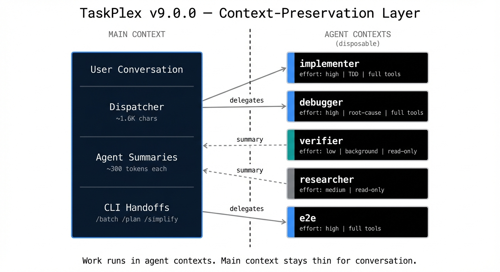

# TaskPlex

<p align="center">
  
</p>

[](https://github.com/flight505/taskplex)
[](LICENSE)
[](https://github.com/anthropics/claude-code)

**Context-preservation layer for Claude Code.** Routes all work to subagents so the main context window stays thin for conversation and coordination. Implementation, debugging, testing, and exploration each run in their own context — the main window never fills up with file reads, test output, or debug traces.

**For complete projects and long-running builds:** Use [SDK-Bridge](https://github.com/flight505/sdk-bridge).

---

## The Problem

Claude Code's context window is its most precious resource. A single debugging session — reading files, tracing errors, running tests — can consume tens of thousands of tokens. A feature implementation with TDD adds even more. Stack a few tasks in one session and the context is full, performance degrades, and earlier instructions get lost.

## The Solution

TaskPlex ensures **all work runs in subagents**. Each agent gets its own context window, does its work, and returns a concise summary (~200-500 chars). The main context only ever holds:

- The dispatcher rules (~1.6K chars, injected at session start)
- User conversation
- Agent summaries
- CLI command handoffs

Everything else — every file read, every test run, every debug trace — lives and dies in agent context windows.

---

## Agents

| Agent | Work Type | Effort | Background | Tools |
|-------|-----------|--------|------------|-------|
| **@taskplex-implementer** | Features, bugfixes, refactors (TDD enforced) | high | no | Full |
| **@taskplex-debugger** | Bug investigation + fix | high | no | Full |
| **@taskplex-verifier** | Test/build verification | low | **yes** | Read-only |
| **@taskplex-researcher** | Design exploration, brainstorming | medium | no | Read-only |
| **@taskplex-e2e** | Systematic E2E testing | high | no | Full |

**Why these five?** They cover every type of development work. The dispatcher routes based on what you're doing, not what discipline to enforce. Each agent is tuned: `effort` controls reasoning depth, `background` lets verification run without blocking, read-only tools prevent accidental edits during research.

All agents have `memory: project` — they learn your codebase patterns across sessions.

## Skills (4)

Skills stay in main context for interactive workflows that need user dialogue:

| Skill | When |
|-------|------|
| `using-taskplex` | Always-on dispatcher (injected at session start) |
| `using-git-worktrees` | Feature work needing branch isolation |
| `finishing-a-development-branch` | Ready to merge, PR, or discard |
| `writing-skills` | Creating or editing SKILL.md files |

## Commands

| Command | Delegates to |
|---------|-------------|
| `/e2e-test` | @taskplex-e2e |

Planning uses the built-in `/plan` mode. Parallel execution uses `/batch`.

---

## Quick Start

### Prerequisites

- [Claude Code CLI](https://code.claude.com) (v2.1.78+)
- Git repository

### Installation

```bash
# Add marketplace
/plugin marketplace add flight505/flight505-marketplace

# Install plugin
/plugin install taskplex@flight505-marketplace
```

### Usage

**Just start working.** TaskPlex activates automatically. When you ask Claude to implement a feature, fix a bug, or explore a design — it delegates to the right agent. You never need to think about context management.

**Explicit commands:**
- `/e2e-test [url]` — Systematic E2E testing
- `/plan` — Built-in plan mode for design before coding
- `/batch` — Parallel execution from plan files

---

## Architecture

```
taskplex/
├── .claude-plugin/plugin.json        # v9.0.0
├── agents/                           # 5 work-type agents
│   ├── taskplex-implementer.md       # Code changes (TDD, effort:high)
│   ├── taskplex-debugger.md          # Investigation + fix (effort:high)
│   ├── taskplex-verifier.md          # Background checks (effort:low, background:true)
│   ├── taskplex-researcher.md        # Exploration (effort:medium, read-only)
│   └── taskplex-e2e.md              # E2E testing (effort:high)
├── skills/                           # 4 interactive skills
│   ├── using-taskplex/               # Context-preservation dispatcher
│   ├── using-git-worktrees/
│   ├── finishing-a-development-branch/
│   └── writing-skills/
├── commands/
│   └── e2e-test.md                  # → @taskplex-e2e
├── hooks/
│   ├── hooks.json                   # SessionStart
│   ├── run-hook.cmd
│   └── session-start
└── evals/
    └── discipline-eval/             # Evaluation harness
```

| Component | Count | Purpose |
|-----------|-------|---------|
| Agents | 5 | One per work type — own context windows |
| Skills | 4 | Dispatcher + interactive workflows (main context) |
| Commands | 1 | E2E testing entry point |
| Hooks | 1 | SessionStart injects dispatcher |

---

## Design Decisions

### Why agents for everything — even what Claude does well?

Eval showed Claude handles debugging and code review natively (100% baseline). But that's not the point. A debug session that reads 10 files and runs 5 commands consumes thousands of tokens **in the main context**. By running in an agent, those tokens are consumed in a disposable context window and only the summary comes back.

### Why not just use built-in subagents?

Claude Code has built-in Explore, Plan, and general-purpose subagents. But they're generic. TaskPlex agents are **tuned per work type**: the implementer enforces TDD (which Claude scored 0% on without enforcement), the verifier runs in background with low effort, the researcher is read-only. Generic agents don't give you this.

### Why `memory: project` on every agent?

Agents learn your codebase across sessions. The debugger remembers common failure modes. The implementer remembers test framework patterns. The researcher remembers architectural decisions. This compounds over time.

### What was removed from v8?

| v8 Component | v9 Status | Why |
|---|---|---|
| 11 discipline skills | 5 agents + 4 skills | Skills injected into main context; agents don't |
| write-plan command | Removed | Built-in `/plan` mode |
| brainstorm skill | → @taskplex-researcher | Agent keeps exploration context out |
| TDD skill | → @taskplex-implementer | Agent with TDD enforcement |
| Debugging skill | → @taskplex-debugger | Agent keeps investigation context out |
| Verification skill | → @taskplex-verifier | Background agent, read-only |
| Code review skill | → @taskplex-debugger (when relevant) | Claude handles review natively |

---

## Evaluation

TaskPlex includes an eval harness to measure whether agents/rules actually help:

```bash
cd evals/discipline-eval
./run-eval.sh            # Run baseline vs rules on 7 scenarios
./run-eval.sh --judge    # Score transcripts with Haiku
```

See `evals/discipline-eval/README.md` for details.

---

## References

- [SDK-Bridge](https://github.com/flight505/sdk-bridge) — PRD-driven project execution
- [Claude Code Subagents](https://code.claude.com/docs/en/sub-agents.md)
- [Claude Code Plugins](https://code.claude.com/docs/en/plugins.md)
- [Claude Code Agent Teams](https://code.claude.com/docs/en/agent-teams.md)

---

## License

MIT © [Jesper Vang](https://github.com/flight505)
