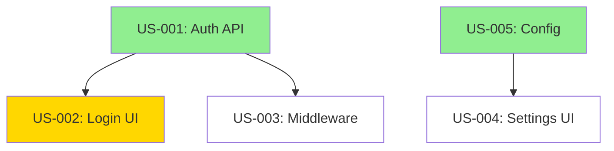

# TaskPlex v2.0: State-of-the-Art Evolution Plan

**Author:** Claude (analysis for Jesper Vang)
**Date:** 2026-02-17
**Context:** Opus 4.6 capabilities (verified) + deep codebase review of TaskPlex v1.2.1

---

## Research Sources

This document is grounded in the following verified sources:

- [What's new in Claude 4.6 — Official API Docs](https://platform.claude.com/docs/en/about-claude/models/whats-new-claude-4-6)
- [Introducing Claude Opus 4.6 — Anthropic Blog](https://www.anthropic.com/news/claude-opus-4-6)
- [Compaction API Documentation](https://platform.claude.com/docs/en/build-with-claude/compaction)
- [Agent Teams — Claude Code Docs](https://code.claude.com/docs/en/agent-teams)
- [Sub-Agent Best Practices — claudefa.st](https://claudefa.st/blog/guide/agents/sub-agent-best-practices)
- [Sub-Agents in Claude Code — responseawareness](https://responseawareness.substack.com/p/sub-agents-in-claude-code-the-subagent)
- [How Claude Code Got Better by Protecting Context](https://hyperdev.matsuoka.com/p/how-claude-code-got-better-by-protecting)
- [Claude Code Hooks Guide](https://code.claude.com/docs/en/hooks)
- Full codebase review of TaskPlex v1.2.1 (all agents, scripts, skills, hooks, monitor)

---

## Executive Summary

TaskPlex v1.2.1 was designed around a pre-Opus-4.6 mental model: short-lived agents, fresh context each iteration, bash orchestration stitching together disposable Claude invocations. Opus 4.6 introduces three capabilities that change the design space:

1. **Context compaction** (beta) — automatic server-side summarization enabling effectively infinite conversations. Configurable trigger threshold, custom summarization prompts, pause-after-compaction for message preservation. Claude Code triggers at 75% utilization to preserve 25% as working memory.

2. **Agent Teams** (research preview) — multiple Claude instances that coordinate via a shared task list and can message each other directly, not just report back to a parent. This is fundamentally different from subagents.

3. **Adaptive thinking with effort levels** — four levels (low/medium/high/max) where Claude dynamically decides whether to think at all. The old `budget_tokens` approach is deprecated.

Plus: 1M token context (beta, 76% on MRCR v2), 128K output tokens, fast mode (2.5x speed at premium pricing).

The core thesis: **stop fighting context loss and start embracing context persistence — but understand where the boundaries actually are.**

---

## Part 1: Fundamental Architecture Shifts

### 1.1 Hybrid Orchestration: Intelligent Agent + Bash Scaffold

**Current:** `taskplex.sh` (1,780 lines of bash) is the orchestrator. It's dumb — it can't reason about why a story failed, adapt the plan, or notice cross-story patterns.

**What I originally proposed:** Kill the bash orchestrator entirely, replace with a persistent Opus agent.

**What's actually feasible:** A hybrid. The bash orchestrator is still needed for things agents can't do: PID management, signal trapping (`SIGTERM`, `SIGKILL`), worktree lifecycle, process monitoring, and crash recovery. But the *decision-making* should move to a persistent Opus agent.

**Proposed architecture:**

```
taskplex.sh (bash scaffold)
  ├── Process management (PID, signals, cleanup)
  ├── Git operations (branch, worktree, merge)
  └── Spawns/manages the orchestrator agent
        │
        ▼
orchestrator agent (persistent Opus 4.6 with compaction)
  ├── Reads prd.json, knowledge store
  ├── Decides next story, model, effort level
  ├── Generates context briefs (still needed for subagents!)
  ├── Spawns implementer/validator via Task tool
  ├── Analyzes results, extracts learnings
  ├── Adapts plan when failures reveal wrong assumptions
  └── Writes decisions back to prd.json + knowledge store
```

The bash script becomes a thin supervisor: it launches the orchestrator agent, monitors its health, handles crashes, and manages the OS-level concerns. The orchestrator agent handles all the intelligence.

**Why context briefs are still needed:** Each subagent spawned via Task tool gets fresh context. Compaction helps the *orchestrator* remember across stories, but implementers still start cold. The difference is that the orchestrator can now craft *better* context briefs because it has compacted memory of everything that happened, not just what's in `knowledge.md`.

**Compaction configuration for the orchestrator:**

```python
# Based on verified API docs
context_management={
    "edits": [{
        "type": "compact_20260112",
        "trigger": {"type": "input_tokens", "value": 150000},
        "pause_after_compaction": True,  # preserve recent story results
        "instructions": "Focus on preserving: story completion status, "
                       "learnings from each story, error patterns, "
                       "codebase patterns discovered, and current plan state. "
                       "Include file paths and function names mentioned."
    }]
}
```

Using `pause_after_compaction: true` lets the orchestrator preserve the most recent story's full results verbatim (not summarized) while compacting older history.

**Cost tracking via compaction:** The API returns `usage.iterations` showing compaction token usage separately. Count compactions × trigger threshold to estimate total consumption and enforce budgets — this is explicitly documented as a supported pattern.

---

### 1.2 Agent Teams for Parallel Execution

**Current:** `parallel.sh` (789 lines of bash) manages parallel execution via git worktrees, bash subshells, PID polling with 5-second intervals, and space-separated lists (for bash 3.2 compatibility). It works, but it's fragile and opaque.

**What Opus 4.6 actually offers:** Agent Teams — a first-class feature where multiple Claude instances coordinate via a shared task list with automatic dependency management, and can message each other directly.

**Key differences from TaskPlex's current subagent approach:**

| Aspect | TaskPlex v1.2 parallel | Agent Teams |
|--------|----------------------|-------------|
| Coordination | Bash PID polling | Shared task list with deps |
| Communication | None (isolated) | Direct inter-agent messaging |
| Conflict detection | Manual `related_to` | Agents can discuss file ownership |
| Failure handling | Bash exit codes | Agents report and discuss solutions |
| Monitoring | Fire-and-forget curl | Team Lead observes all agents |
| Process management | PID files, kill signals | Claude Code manages lifecycle |

**Proposed integration — two modes:**

**Mode 1: "Team" (new, Opus 4.6)** — For projects with 3+ independent stories per wave. The orchestrator creates an Agent Team where each teammate implements one story. Teammates can:
- Coordinate on shared files ("I'm modifying `src/api/routes.ts`, hold off on that file")
- Cross-validate each other's work before merge
- Surface conflicts early through direct communication
- Challenge each other's implementation choices

**Mode 2: "Subagent" (current, refined)** — For sequential work or when Agent Teams overhead isn't justified. Keep the current subagent model but with the intelligent orchestrator making decisions.

**Config:**
```json
{
  "parallel_mode": "team",      // "sequential" | "subagent" (current parallel) | "team" (Agent Teams)
  "team_size": 4,               // max teammates per wave
}
```

**What this replaces:** Most of `parallel.sh`. The git worktree lifecycle is still needed (Agent Teams need separate working directories), but PID management, polling loops, and process tracking become unnecessary.

**Caveat (verified):** Agent Teams consume significantly more tokens than subagents because each teammate is a full Claude instance. The [nxcode guide](https://www.nxcode.io/resources/news/claude-agent-teams-parallel-ai-development-guide-2026) reports a project using 16 agents that cost ~$20,000. Start with 2-4 agents per team to understand cost patterns.

---

### 1.3 Adaptive PRD Rewriting During Execution

**Current:** The PRD is frozen after Checkpoint 5. Failures retry with the same plan.

**Proposed:** The intelligent orchestrator can rewrite stories mid-flight when failures reveal fundamental misunderstandings (not just bugs). This is feasible because:

1. The orchestrator has compacted context of all previous stories
2. It can distinguish "code bug" from "wrong approach" via the failure-analyzer skill
3. It has the PRD in context and can modify `prd.json` directly

**Safeguards:**
- Only rewrite after 2 failed retries with the same approach
- Log all rewrites with before/after for user review
- In foreground mode, ask for confirmation before rewriting
- Never change the story's *intent*, only its *approach*

---

## Part 2: Knowledge Architecture

### 2.1 SQLite Knowledge Store (Replaces knowledge.md)

**Current problem:** `knowledge.md` is a flat file capped at 100 lines, trimmed FIFO. No semantic search, no dedup, old learnings lost.

**Proposed:** SQLite-backed store reusing the monitor's existing Bun + SQLite infrastructure. The monitor already has `db.ts` with schema management and WAL mode — extend it.

```sql
CREATE TABLE learnings (
  id INTEGER PRIMARY KEY,
  run_id TEXT,
  story_id TEXT,
  category TEXT CHECK(category IN ('pattern', 'gotcha', 'environment', 'decision')),
  content TEXT NOT NULL,
  importance INTEGER DEFAULT 3 CHECK(importance BETWEEN 1 AND 5),
  created_at TEXT DEFAULT (datetime('now')),
  last_accessed TEXT,
  source TEXT  -- 'agent_output', 'transcript_mining', 'error_analysis'
);

CREATE TABLE learning_refs (
  learning_id INTEGER REFERENCES learnings(id),
  ref_type TEXT CHECK(ref_type IN ('file', 'story', 'function', 'module')),
  ref_value TEXT
);

CREATE INDEX idx_learnings_category ON learnings(category);
CREATE INDEX idx_learning_refs_value ON learning_refs(ref_value);
```

**Retrieval strategy (practical, no embeddings needed initially):**
1. Query by `ref_value` matching files mentioned in the current story's `check_before_implementing`
2. Query by `category = 'gotcha'` (always include recent gotchas)
3. Query by `category = 'environment'` (always include environment notes)
4. Full-text match against story description keywords
5. Orchestrator agent does semantic filtering on results (it's the intelligent part)

**Why not embeddings:** Adding `sqlite-vss` or similar is complexity that isn't justified yet. The orchestrator agent IS a semantic search engine — give it 20 candidate learnings and it'll pick the 5 most relevant ones better than cosine similarity would.

### 2.2 Cross-Run Persistent Memory

The knowledge store persists in `.claude/taskplex-knowledge.db`. Each run tags its learnings with `run_id`. When a new run starts:

1. Load existing learnings from previous runs
2. Previous-run learnings get lower retrieval priority (but aren't deleted)
3. The orchestrator's custom compaction prompt includes: "Preserve knowledge about this project's conventions, tech stack, and known gotchas from previous runs"

This is low effort (the DB already persists) and high impact (no more re-discovering "this project uses pnpm not npm").

### 2.3 Agent Transcript Mining

**Verified capability:** SubagentStop hooks provide `agent_transcript_path` — the full path to the subagent's conversation transcript. This is real and documented.

**Proposed:** After each story, spawn a cheap Haiku analyst agent that reads the transcript and extracts:

- Files read but not modified (implicit dependencies → populate `related_to` for future runs)
- Error patterns encountered and resolved (→ `gotcha` learnings)
- Tool usage patterns (→ detect agent inefficiency, improve prompts)

This feeds directly into the knowledge store with `source = 'transcript_mining'`.

---

## Part 3: Execution Intelligence

### 3.1 Effort-Adaptive Story Execution

**Verified API details:** Effort levels are `low`, `medium`, `high`, `max`. With `thinking: {type: "adaptive"}`, Claude dynamically decides whether to think at all. This is GA on Opus 4.6 (no beta header needed for effort).

**Proposed mapping:**

| Scenario | Model | Effort | Estimated relative cost |
|----------|-------|--------|------------------------|
| Already-implemented check | Haiku 4.5 | — | ~$0.01 |
| Simple story (1-2 criteria) | Sonnet 4.5 | — | ~$0.10 |
| Standard story (3-5 criteria) | Sonnet 4.5 | — | ~$0.30 |
| Complex story (6+ criteria) | Opus 4.6 | high | ~$1.50 |
| Failed retry (1st retry) | Opus 4.6 | high | ~$2.00 |
| Failed retry (2nd retry) | Opus 4.6 | max | ~$4.00 |

**The orchestrator decides** based on: criteria count, `implementation_hint` complexity, dependency depth, and failure history. This is a reasoning task that benefits from the orchestrator being a persistent Opus agent with full run context.

**Fast mode option:** For standard stories where speed matters more than cost, use `speed: "fast"` (2.5x faster, $30/$150 per MTok). Trade-off: same intelligence, more expensive, much faster throughput.

### 3.2 Preemptive Conflict Detection

Before parallel execution begins, run `check_before_implementing` commands for ALL stories and build a file-overlap matrix:

```bash
# For each story, collect matching files
for story in $(jq -r '.userStories[].id' prd.json); do
  commands=$(jq -r ".userStories[] | select(.id==\"$story\") | .check_before_implementing[]" prd.json)
  for cmd in $commands; do
    eval "$cmd" 2>/dev/null | while read file; do
      echo "$story:$file"
    done
  done
done | sort | uniq > /tmp/story-file-map.txt

# Find overlaps
# Stories touching the same file get related_to edges
```

This is simple bash that runs before execution and auto-populates `related_to` in `prd.json`. No agent needed.

### 3.3 Hook-Based Feedback Loop

**Current hooks:** Fire-and-forget telemetry to the monitor. The only feedback hook is `check-destructive.sh` (PostToolUse, blocks dangerous git commands).

**Opus 4.6 hook capabilities (verified):**
- `SubagentStart`: Can inject `additionalContext` into spawning agents
- `SubagentStop`: Can return `"decision": "block"` with `reason` to prevent agent from stopping
- `PreCompact`: Runs before context compaction, can backup/preserve data

**Proposed new hooks:**

**SubagentStart → Knowledge injection:**
```json
{
  "type": "SubagentStart",
  "matcher": {"agent_type": "implementer"},
  "hooks": [{
    "type": "command",
    "command": "${CLAUDE_PLUGIN_ROOT}/hooks/inject-knowledge.sh"
  }]
}
```
The script queries the knowledge store for learnings relevant to the current story and returns them as `additionalContext`. The implementer starts with project-specific knowledge *automatically*, without the orchestrator having to construct a context brief manually.

**SubagentStop → Result validation:**
```json
{
  "type": "SubagentStop",
  "matcher": {"agent_type": "implementer"},
  "hooks": [{
    "type": "command",
    "command": "${CLAUDE_PLUGIN_ROOT}/hooks/validate-result.sh"
  }]
}
```
The script runs the project's typecheck/build commands. If they fail, it returns `"decision": "block"` with the error output, forcing the implementer to fix the issue before completing. This turns the post-hoc validator into an inline quality gate.

**PreCompact → Context preservation:**
```json
{
  "type": "PreCompact",
  "hooks": [{
    "type": "command",
    "command": "${CLAUDE_PLUGIN_ROOT}/hooks/pre-compact.sh"
  }]
}
```
Before the orchestrator's context is compacted, back up the current state to the knowledge store. This provides a recovery point if compaction loses critical details.

### 3.4 Test-Driven Implementation Mode

Offer a TDD mode where a test-writer agent creates failing tests from acceptance criteria before the implementer runs. The implementer's goal becomes "make these tests pass" rather than "interpret these prose criteria."

**New agent:**
```yaml
name: test-writer
model: sonnet
tools: [Bash, Read, Write, Glob, Grep]
purpose: Write failing tests from acceptance criteria before implementation
```

**Flow:** test-writer → implementer → validator (confirms tests pass + coverage)

---

## Part 4: Developer Experience

### 4.1 Live Intervention via Monitor Dashboard

The monitor dashboard already has a Bun HTTP server. Add a REST endpoint for user commands:

```
POST /api/commands
{ "type": "skip", "story_id": "US-003" }
{ "type": "hint", "story_id": "US-005", "content": "Use the existing AuthService" }
{ "type": "pause" }
{ "type": "reorder", "story_id": "US-007", "before": "US-004" }
{ "type": "budget", "remaining": 25.00 }
```

The orchestrator polls `/api/commands` between stories (or the bash scaffold watches a command file). The dashboard gets a command input panel.

### 4.2 Cost Tracking

The Compaction API returns `usage.iterations` with per-iteration token counts. For non-compaction calls, `usage.input_tokens` and `usage.output_tokens` are accurate. Track both.

```json
// Monitor event enrichment
{
  "event_type": "story.complete",
  "story_id": "US-001",
  "cost": {
    "model": "sonnet",
    "input_tokens": 45000,
    "output_tokens": 12000,
    "compaction_tokens": 0,
    "estimated_cost_usd": 0.42,
    "attempts": 1
  }
}
```

Dashboard shows running total, per-story breakdown, and budget remaining.

### 4.3 Checkpoint Resume

After each story completes, write checkpoint:

```json
{
  "run_id": "abc123",
  "completed_stories": ["US-001", "US-002"],
  "git_state": { "branch": "taskplex/feature", "commit": "abc123" },
  "knowledge_db_path": ".claude/taskplex-knowledge.db",
  "prd_hash": "sha256:...",
  "timestamp": "2026-02-17T14:30:00Z"
}
```

On restart: detect checkpoint, verify git state matches, resume from next pending story. The knowledge store provides continuity; `prd.json` is the source of truth for story status.

### 4.4 Dependency Graph Visualization

Add a Mermaid DAG view to the monitor dashboard, generated from `prd.json`:



Color-coded: green = complete, yellow = in progress, white = pending, red = failed, gray = skipped.

---

## Part 5: Quality & Safety

### 5.1 Post-Merge Regression Check with Rollback

After each story merge, run the full test suite. If tests that passed before now fail:

1. `git revert` the merge commit
2. Mark story as `needs_rework` (distinct from `skipped`)
3. Log the regression details in the knowledge store
4. Continue to next story
5. Retry the failed story later with regression context

This protects the feature branch's integrity, which the current system doesn't guarantee.

### 5.2 Scope Drift Detection

Compare git diff against expected scope (files from `check_before_implementing` + `implementation_hint`). Flag unexpected file modifications. The orchestrator decides: accept (agent had good reason) or revert out-of-scope changes.

### 5.3 Code Review Agent

```yaml
name: code-reviewer
model: sonnet
tools: [Bash, Read, Glob, Grep]
purpose: Review implementation diff for quality, security, consistency
```

Runs on the git diff after implementation, before merge. Outputs structured findings with severity. Critical issues block merge; minor issues are logged.

---

## Part 6: What Should Be Built Completely Differently

### 6.1 The PRD Format

**Current:** Two-step process (markdown → JSON) with a skill for each.

**Better:** Single structured format from the start. The prd-generator should output JSON directly with a markdown preview. The conversion step introduces translation errors and wastes a full agent invocation.

Make the PRD a living document: annotate each story during execution with timestamps, actual files modified, learnings extracted, and final status. The PRD becomes both plan and execution record.

### 6.2 The Hook Architecture

**Current:** Fire-and-forget telemetry. Can't influence execution except for destructive command blocking.

**Better:** Bidirectional hooks using SubagentStart (`additionalContext` injection) and SubagentStop (`"decision": "block"` for validation). The hook system becomes a feedback loop, not just telemetry.

The SubagentStart knowledge injection hook alone would eliminate the need for explicit context brief generation — the hook queries the knowledge store and injects relevant learnings automatically.

### 6.3 The Bash Orchestrator's Role

**Current:** The bash script IS the brain — all decision logic is in bash.

**Better:** The bash script is the *skeleton* — process management, signal handling, git operations. An Opus orchestrator agent is the *brain* — story selection, retry decisions, plan adaptation, knowledge curation. The bash script calls the orchestrator for decisions and executes its instructions.

---

## Part 7: Novel Capabilities

### 7.1 Self-Improving Prompts via Cross-Run Analytics

After each run, the knowledge store accumulates which stories succeeded first-try vs. needed retries, and what the retry context was. Over multiple runs, patterns emerge:

- "TypeScript projects: agents fail when they use `require()` — add ESM import instruction"
- "React projects: agents forget to run `npm install` after adding dependencies"
- "Python projects: agents don't activate virtualenvs"

An analytics agent can propose prompt.md modifications based on these patterns. This is the knowledge architecture's logical conclusion — learning how to *instruct* agents better, not just learning facts.

### 7.2 Agent Team Code Reviews

Use Agent Teams for code review: spawn 3 reviewer teammates focused on security, performance, and test coverage. They cross-reference findings, challenge each other, and produce a unified review. This is one of the documented strong use cases for Agent Teams.

### 7.3 Human-in-the-Loop Review Points

Allow PRD stories to be marked `requires_review: true`. The orchestrator pauses after implementation, notifies via the monitor dashboard, and waits for approval. Critical for: database migrations, auth changes, public API modifications.

### 7.4 Predictive Estimation

After several runs on a project, use the knowledge store's cost and duration data to predict future run costs and durations. Display at Checkpoint 6 alongside the current formula-based estimate.

---

## Implementation Priority (Revised)

| Priority | Feature | Impact | Effort | Dependencies | Verified? |
|----------|---------|--------|--------|-------------|-----------|
| **P0** | Hybrid orchestration (1.1) | Transformative | High | Compaction API (beta) | Yes — API docs verified |
| **P0** | Effort-adaptive execution (3.1) | High cost savings | Medium | Orchestrator | Yes — effort is GA |
| **P1** | Agent Teams parallel mode (1.2) | Replaces parallel.sh | High | Agent Teams (research preview) | Yes — but research preview |
| **P1** | Knowledge store (2.1) | Major quality improvement | Medium | SQLite (reuse monitor) | N/A — new code |
| **P1** | Hook-based feedback loop (3.3) | Quality + automation | Medium | SubagentStart/Stop hooks | Yes — hooks docs verified |
| **P1** | Cost tracking (4.2) | Essential DX | Medium | usage.iterations API | Yes — API docs verified |
| **P2** | Cross-run memory (2.2) | Compound improvement | Low | Knowledge store | N/A — new code |
| **P2** | Checkpoint resume (4.3) | Reliability | Medium | None | N/A — new code |
| **P2** | Adaptive PRD rewriting (1.3) | Novel capability | Medium | Orchestrator | N/A — novel |
| **P2** | Pre-merge regression check (5.1) | Safety | Low | None | N/A — new code |
| **P3** | TDD mode (3.4) | Quality improvement | Medium | New agent | N/A — new code |
| **P3** | Transcript mining (2.3) | Knowledge depth | Medium | SubagentStop transcript path | Yes — verified |
| **P3** | Self-improving prompts (7.1) | Long-term improvement | High | Knowledge store + analytics | N/A — novel |
| **P3** | Live intervention (4.1) | DX improvement | Low | Monitor | N/A — new code |

---

## Key Constraints and Caveats

1. **Compaction is beta.** The API could change. Build with a fallback path that degrades to the current file-based approach.

2. **Agent Teams are research preview.** Less mature than compaction. Token costs are significantly higher. Start with subagent mode as default, Agent Teams as opt-in.

3. **Compaction helps the orchestrator, not subagents.** Each implementer spawned via Task still starts fresh. Context briefs are still necessary — they just get better because the orchestrator has better memory.

4. **Custom compaction instructions completely replace the default prompt.** If you customize, you must include everything the default covers (state, next steps, learnings) plus your additions.

5. **Fast mode is research preview** and costs 6x the standard rate ($30/$150 vs $5/$25 per MTok). Only justified for time-critical workflows.

6. **Bash scaffold is still needed.** Agents can't do `trap`, `kill`, PID management, or worktree filesystem operations reliably. The hybrid approach is necessary, not a compromise.

---

## Summary

**TaskPlex v1.x:** Bash orchestrator spawns disposable agents, reconstructs context each time, manages state through files.

**TaskPlex v2.0:** Bash scaffold manages processes and git; persistent Opus orchestrator with compaction makes all intelligent decisions; Agent Teams replace bash-managed parallelism; knowledge store with cross-run persistence replaces flat-file learnings; hooks become a bidirectional feedback loop, not just telemetry.

The paradigm shift is real, but more nuanced than "replace everything with a persistent agent." The bash scaffold earns its keep for OS-level operations. The compaction API earns its keep for orchestrator intelligence. Agent Teams earn their keep for parallel execution. Each Opus 4.6 feature has a specific role — none of them is a silver bullet.
