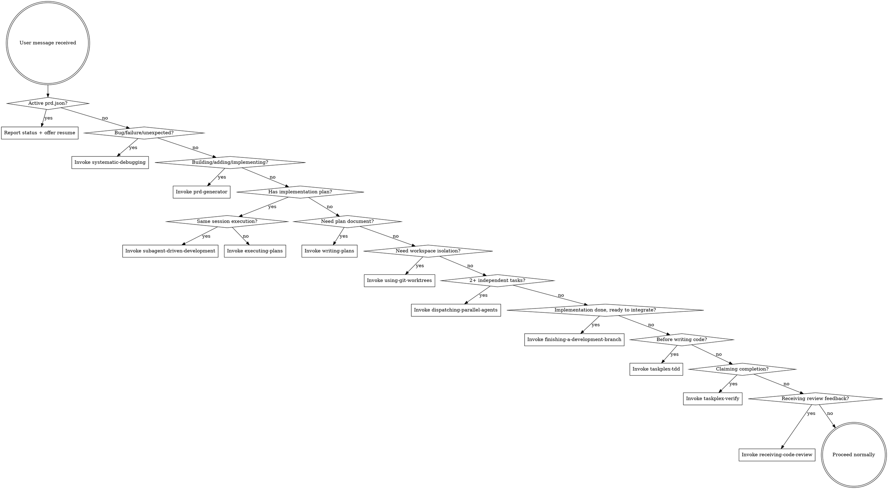

# Complete Superpowers Replacement — Implementation Plan

> **For Claude:** Execute tasks sequentially. Each task is one focused unit of work. Commit after each batch.

**Goal:** Adapt the 9 missing Superpowers skills into TaskPlex so the "Replaces Superpowers" claim is actually true. TaskPlex becomes: all 14 Superpowers discipline skills + PRD-driven autonomous execution + SQLite knowledge persistence + error recovery.

**Architecture:** Copy-and-adapt approach. Superpowers skills are MIT-licensed markdown files. Core content stays intact (battle-tested). Cross-references change from `superpowers:` to `taskplex:`. Integration sections updated for TaskPlex context. Supporting files included where needed.

**Tech Stack:** Markdown (SKILL.md with YAML frontmatter), shell scripts (supporting files)

**Source:** `~/.claude/plugins/cache/superpowers-marketplace/superpowers/4.3.1/skills/`

---

## Inventory

### What TaskPlex Already Has (6 skills)

| TaskPlex Skill | Replaces Superpowers Skill | Status |
|---|---|---|
| `using-taskplex` | `using-superpowers` | Needs expansion (routes 5 skills, should route 14) |
| `prd-generator` | `brainstorming` | Done |
| `prd-converter` | `writing-plans` | Done (plan → JSON, not plan doc) |
| `taskplex-tdd` | `test-driven-development` | Done |
| `taskplex-verify` | `verification-before-completion` | Done |
| `failure-analyzer` | _(unique to TaskPlex)_ | Done |

### What's Missing (9 skills + 1 command)

| # | Superpowers Skill | Supporting Files | Adaptation Needed |
|---|---|---|---|
| 1 | `systematic-debugging` | `root-cause-tracing.md`, `defense-in-depth.md`, `condition-based-waiting.md`, `condition-based-waiting-example.ts`, `find-polluter.sh` | Cross-refs: `superpowers:test-driven-development` → `taskplex:taskplex-tdd`, `superpowers:verification-before-completion` → `taskplex:taskplex-verify` |
| 2 | `dispatching-parallel-agents` | None | Minimal — standalone skill, no cross-refs |
| 3 | `using-git-worktrees` | None | Cross-refs: `brainstorming` → `prd-generator`, `subagent-driven-development`, `executing-plans`, `finishing-a-development-branch` |
| 4 | `finishing-a-development-branch` | None | Cross-refs: `subagent-driven-development`, `executing-plans`, `using-git-worktrees` |
| 5 | `requesting-code-review` | `code-reviewer.md` (prompt template) | Cross-refs: `subagent-driven-development`, `executing-plans` |
| 6 | `receiving-code-review` | None | Minimal — standalone discipline skill |
| 7 | `subagent-driven-development` | `implementer-prompt.md`, `spec-reviewer-prompt.md`, `code-quality-reviewer-prompt.md` | Cross-refs to 5 other skills. Key integration point. |
| 8 | `writing-skills` | `anthropic-best-practices.md`, `testing-skills-with-subagents.md`, `persuasion-principles.md`, `graphviz-conventions.dot`, `render-graphs.js`, `examples/` | Cross-refs: `superpowers:test-driven-development` → `taskplex:taskplex-tdd` |
| 9 | `executing-plans` | None | Cross-refs: `using-git-worktrees`, `writing-plans` → `prd-converter`, `finishing-a-development-branch` |
| 10 | `writing-plans` (command/skill) | None | TaskPlex has `prd-converter` for JSON but no plan-writing skill. `prd-generator` creates PRDs, not impl plans. Need this for the writing-plans → executing-plans workflow. |

### Also Required

- **`using-taskplex` rewrite** — expand routing table from 5 skills to 14+
- **`plugin.json` update** — register all new skills
- **`session-context.sh` unchanged** — already injects `using-taskplex`, so expanded routing table propagates automatically

---

## Task 1: Create `systematic-debugging` skill

The most impactful missing skill. 297 lines + 5 supporting files.

**Files:**
- Create: `skills/systematic-debugging/SKILL.md`
- Create: `skills/systematic-debugging/root-cause-tracing.md`
- Create: `skills/systematic-debugging/defense-in-depth.md`
- Create: `skills/systematic-debugging/condition-based-waiting.md`
- Create: `skills/systematic-debugging/condition-based-waiting-example.ts`
- Create: `skills/systematic-debugging/find-polluter.sh`

**Step 1: Copy source files**

```bash
cp -r ~/.claude/plugins/cache/superpowers-marketplace/superpowers/4.3.1/skills/systematic-debugging/ \
  skills/systematic-debugging/
```

**Step 2: Update cross-references in SKILL.md**

Replace all `superpowers:` prefixes:
- `superpowers:test-driven-development` → `taskplex:taskplex-tdd`
- `superpowers:verification-before-completion` → `taskplex:taskplex-verify`

**Step 3: Remove test files (not needed in distribution)**

Delete `test-academic.md`, `test-pressure-1.md`, `test-pressure-2.md`, `test-pressure-3.md`, `CREATION-LOG.md` — these are Superpowers' development artifacts, not runtime files.

**Step 4: Verify SKILL.md frontmatter**

```yaml
---
name: systematic-debugging
description: Use when encountering any bug, test failure, or unexpected behavior, before proposing fixes
---
```

Frontmatter stays identical — the description is well-written (trigger-focused, no workflow summary).

---

## Task 2: Create `dispatching-parallel-agents` skill

Standalone skill, no supporting files, minimal adaptation.

**Files:**
- Create: `skills/dispatching-parallel-agents/SKILL.md`

**Step 1: Copy source**

```bash
mkdir -p skills/dispatching-parallel-agents
cp ~/.claude/plugins/cache/superpowers-marketplace/superpowers/4.3.1/skills/dispatching-parallel-agents/SKILL.md \
  skills/dispatching-parallel-agents/SKILL.md
```

**Step 2: No cross-references to update**

This skill is self-contained. Frontmatter and content stay as-is.

---

## Task 3: Create `using-git-worktrees` skill

**Files:**
- Create: `skills/using-git-worktrees/SKILL.md`

**Step 1: Copy source**

```bash
mkdir -p skills/using-git-worktrees
cp ~/.claude/plugins/cache/superpowers-marketplace/superpowers/4.3.1/skills/using-git-worktrees/SKILL.md \
  skills/using-git-worktrees/SKILL.md
```

**Step 2: Update cross-references**

In the "Integration" section at the bottom:
- `brainstorming` → `taskplex:prd-generator`
- `subagent-driven-development` → `taskplex:subagent-driven-development`
- `executing-plans` → `taskplex:executing-plans`
- `finishing-a-development-branch` → `taskplex:finishing-a-development-branch`

**Step 3: Update directory suggestion**

Change `~/.config/superpowers/worktrees/` to `~/.config/taskplex/worktrees/` in the user prompt (option 2).

---

## Task 4: Create `finishing-a-development-branch` skill

**Files:**
- Create: `skills/finishing-a-development-branch/SKILL.md`

**Step 1: Copy source**

```bash
mkdir -p skills/finishing-a-development-branch
cp ~/.claude/plugins/cache/superpowers-marketplace/superpowers/4.3.1/skills/finishing-a-development-branch/SKILL.md \
  skills/finishing-a-development-branch/SKILL.md
```

**Step 2: Update cross-references**

In the "Integration" section:
- `subagent-driven-development` → `taskplex:subagent-driven-development`
- `executing-plans` → `taskplex:executing-plans`
- `using-git-worktrees` → `taskplex:using-git-worktrees`

---

## Task 5: Create `requesting-code-review` skill

**Files:**
- Create: `skills/requesting-code-review/SKILL.md`
- Create: `skills/requesting-code-review/code-reviewer.md` (prompt template)

**Step 1: Copy source**

```bash
cp -r ~/.claude/plugins/cache/superpowers-marketplace/superpowers/4.3.1/skills/requesting-code-review/ \
  skills/requesting-code-review/
```

**Step 2: Update cross-references in SKILL.md**

- `superpowers:code-reviewer` → `taskplex:code-reviewer`
- `subagent-driven-development` → `taskplex:subagent-driven-development`
- `executing-plans` → `taskplex:executing-plans`

**Step 3: Verify code-reviewer.md template**

The prompt template references the code-reviewer agent. TaskPlex already has `agents/code-reviewer.md`. Verify the template is compatible — it should work since TaskPlex's code-reviewer was modeled after Superpowers'.

---

## Task 6: Create `receiving-code-review` skill

**Files:**
- Create: `skills/receiving-code-review/SKILL.md`

**Step 1: Copy source**

```bash
mkdir -p skills/receiving-code-review
cp ~/.claude/plugins/cache/superpowers-marketplace/superpowers/4.3.1/skills/receiving-code-review/SKILL.md \
  skills/receiving-code-review/SKILL.md
```

**Step 2: No cross-references to update**

Self-contained discipline skill. Content stays as-is.

---

## Task 7: Create `subagent-driven-development` skill

The most complex adaptation. Has 3 prompt templates and references 5 other skills.

**Files:**
- Create: `skills/subagent-driven-development/SKILL.md`
- Create: `skills/subagent-driven-development/implementer-prompt.md`
- Create: `skills/subagent-driven-development/spec-reviewer-prompt.md`
- Create: `skills/subagent-driven-development/code-quality-reviewer-prompt.md`

**Step 1: Copy source**

```bash
cp -r ~/.claude/plugins/cache/superpowers-marketplace/superpowers/4.3.1/skills/subagent-driven-development/ \
  skills/subagent-driven-development/
```

**Step 2: Update cross-references in SKILL.md**

In the "Integration" section:
- `superpowers:using-git-worktrees` → `taskplex:using-git-worktrees`
- `superpowers:writing-plans` → `taskplex:writing-plans`
- `superpowers:requesting-code-review` → `taskplex:requesting-code-review`
- `superpowers:finishing-a-development-branch` → `taskplex:finishing-a-development-branch`
- `superpowers:test-driven-development` → `taskplex:taskplex-tdd`
- `superpowers:executing-plans` → `taskplex:executing-plans`

**Step 3: Update prompt templates**

In each prompt template, update any `superpowers:` skill references to `taskplex:` equivalents.

---

## Task 8: Create `writing-skills` skill

Large skill (655 lines) with many supporting files. Important for plugin development.

**Files:**
- Create: `skills/writing-skills/SKILL.md`
- Create: `skills/writing-skills/anthropic-best-practices.md`
- Create: `skills/writing-skills/testing-skills-with-subagents.md`
- Create: `skills/writing-skills/persuasion-principles.md`
- Create: `skills/writing-skills/graphviz-conventions.dot`
- Create: `skills/writing-skills/render-graphs.js`
- Create: `skills/writing-skills/examples/` (if non-empty)

**Step 1: Copy source**

```bash
cp -r ~/.claude/plugins/cache/superpowers-marketplace/superpowers/4.3.1/skills/writing-skills/ \
  skills/writing-skills/
```

**Step 2: Update cross-references in SKILL.md**

- `superpowers:test-driven-development` → `taskplex:taskplex-tdd`
- `superpowers:systematic-debugging` → `taskplex:systematic-debugging`
- `superpowers:verification-before-completion` → `taskplex:taskplex-verify`

**Step 3: Update skill directory reference**

Change `~/.claude/skills` personal skill directory reference — this stays as-is since it's a general Claude Code concept, not Superpowers-specific.

---

## Task 9: Create `executing-plans` skill

**Files:**
- Create: `skills/executing-plans/SKILL.md`

**Step 1: Copy source**

```bash
mkdir -p skills/executing-plans
cp ~/.claude/plugins/cache/superpowers-marketplace/superpowers/4.3.1/skills/executing-plans/SKILL.md \
  skills/executing-plans/SKILL.md
```

**Step 2: Update cross-references**

In the "Integration" section:
- `superpowers:using-git-worktrees` → `taskplex:using-git-worktrees`
- `superpowers:writing-plans` → `taskplex:writing-plans`
- `superpowers:finishing-a-development-branch` → `taskplex:finishing-a-development-branch`

---

## Task 10: Create `writing-plans` skill

TaskPlex has `prd-generator` (creates PRDs) and `prd-converter` (PRD → JSON), but no skill for writing implementation plans. The Superpowers `writing-plans` skill creates the detailed task-by-task plan doc that `executing-plans` and `subagent-driven-development` consume. Without this, the workflow chain is broken.

**Files:**
- Create: `skills/writing-plans/SKILL.md`

**Step 1: Copy source**

```bash
mkdir -p skills/writing-plans
cp ~/.claude/plugins/cache/superpowers-marketplace/superpowers/4.3.1/skills/writing-plans/SKILL.md \
  skills/writing-plans/SKILL.md
```

**Step 2: Update cross-references**

- `superpowers:executing-plans` → `taskplex:executing-plans`
- `superpowers:subagent-driven-development` → `taskplex:subagent-driven-development`

**Step 3: Update plan header template**

In the plan document header template, change:
```
> **For Claude:** REQUIRED SUB-SKILL: Use superpowers:executing-plans
```
to:
```
> **For Claude:** REQUIRED SUB-SKILL: Use taskplex:executing-plans
```

---

## Task 11: Commit all new skills

```bash
git add skills/systematic-debugging/ skills/dispatching-parallel-agents/ \
  skills/using-git-worktrees/ skills/finishing-a-development-branch/ \
  skills/requesting-code-review/ skills/receiving-code-review/ \
  skills/subagent-driven-development/ skills/writing-skills/ \
  skills/executing-plans/ skills/writing-plans/
git commit -m "feat: add 10 adapted Superpowers skills to complete discipline coverage"
```

---

## Task 12: Rewrite `using-taskplex` routing table

The gate skill currently routes to 5 skills. It needs to route to all 15 (6 existing + 9 new + writing-plans).

**Files:**
- Modify: `skills/using-taskplex/SKILL.md`

**Step 1: Replace the skill catalog table**

New table with all 15 skills:

```markdown
## TaskPlex Skill Catalog

| Skill | Triggers When | What It Does |
|-------|--------------|-------------|
| `taskplex:prd-generator` | User describes a feature, project, or multi-file change | Generates structured PRD with clarifying questions |
| `taskplex:prd-converter` | PRD markdown exists and needs execution as JSON | Converts PRD to prd.json for autonomous execution |
| `taskplex:writing-plans` | Need a detailed task-by-task implementation plan | Creates bite-sized plan doc with TDD steps and exact commands |
| `taskplex:taskplex-tdd` | Before ANY implementation (feature, bugfix, refactor) | Enforces RED-GREEN-REFACTOR discipline |
| `taskplex:taskplex-verify` | Before ANY completion claim ("done", "fixed", "passing") | Enforces fresh evidence before claims |
| `taskplex:systematic-debugging` | Any bug, test failure, or unexpected behavior | 4-phase root cause investigation before fixes |
| `taskplex:dispatching-parallel-agents` | 2+ independent tasks with no shared state | One agent per problem domain, concurrent execution |
| `taskplex:using-git-worktrees` | Starting feature work that needs isolation | Creates isolated git worktree with safety verification |
| `taskplex:finishing-a-development-branch` | Implementation complete, tests pass, ready to integrate | Verify → present options → execute → cleanup |
| `taskplex:requesting-code-review` | After task completion or before merge | Dispatches code-reviewer agent with SHA range |
| `taskplex:receiving-code-review` | Receiving code review feedback | Technical evaluation, not performative agreement |
| `taskplex:subagent-driven-development` | Executing plan with independent tasks in current session | Fresh subagent per task + two-stage review |
| `taskplex:executing-plans` | Executing plan in separate/parallel session | Batch execution with architect review checkpoints |
| `taskplex:writing-skills` | Creating or editing skills | TDD applied to process documentation |
| `taskplex:failure-analyzer` | Implementation fails with unclear error | Categorizes error and suggests retry strategy |
```

**Step 2: Expand the decision graph**



**Step 3: Expand "When to Invoke Each Skill" section**

Add routing rules for all 10 new skills:

```markdown
**systematic-debugging** — Before proposing ANY fix:
- Test failure, bug report, unexpected behavior
- ESPECIALLY when "just one quick fix" seems obvious
- After 2+ failed fix attempts

**dispatching-parallel-agents** — Multiple independent problems:
- 3+ test files failing with different root causes
- Multiple subsystems broken independently
- No shared state between investigations

**using-git-worktrees** — Need isolated workspace:
- Starting feature work
- Before executing implementation plans
- When current workspace has uncommitted changes

**finishing-a-development-branch** — Work is done:
- All tests pass, implementation complete
- Ready to merge, create PR, or decide what to do with branch

**requesting-code-review** — After completing work:
- After each task in subagent-driven development
- After completing major feature
- Before merge to main

**receiving-code-review** — Processing feedback:
- Received code review comments
- Feedback seems unclear or technically questionable
- External reviewer suggestions

**subagent-driven-development** — Executing plan in current session:
- Have an implementation plan with independent tasks
- Want fresh context per task (no pollution)
- Want two-stage review (spec then quality)

**executing-plans** — Executing plan in separate session:
- Have a plan, want batch execution with checkpoints
- Architect review between batches

**writing-plans** — Need detailed implementation plan:
- Have requirements/spec, need task-by-task plan
- Before subagent-driven-development or executing-plans

**writing-skills** — Creating or modifying skills:
- Building new skill for this or another plugin
- Editing existing skill content
```

**Step 4: Update red flags table**

Add entries for the new skills:

```markdown
| "Let me try a quick fix" | Systematic debugging required. Root cause first. |
| "I'll review at the end" | Review after EACH task, not at the end. |
| "Tests pass, ship it" | Use finishing-a-development-branch for proper integration. |
| "I'll do it all in sequence" | Independent tasks → dispatch parallel agents. |
| "The reviewer is wrong" | Use receiving-code-review — verify before dismissing. |
```

**Step 5: Update skill priority**

```markdown
## Skill Priority

When multiple skills could apply, use this order:

1. **Debugging first** (systematic-debugging) — find root cause before anything
2. **Discipline skills** (taskplex-tdd, taskplex-verify, receiving-code-review) — HOW to work
3. **Planning skills** (prd-generator, prd-converter, writing-plans) — WHAT to build
4. **Execution skills** (subagent-driven-development, executing-plans, dispatching-parallel-agents) — DO the work
5. **Integration skills** (requesting-code-review, finishing-a-development-branch, using-git-worktrees) — wrap up
```

**Step 6: Update coexistence section**

```markdown
## Coexistence

TaskPlex includes adapted versions of all Superpowers skills. If both plugins are installed,
TaskPlex's versions take precedence. Users can safely uninstall Superpowers when TaskPlex is active.
All 14 Superpowers skills have TaskPlex equivalents.
```

---

## Task 13: Commit `using-taskplex` rewrite

```bash
git add skills/using-taskplex/SKILL.md
git commit -m "feat: expand using-taskplex routing from 5 to 15 skills"
```

---

## Task 14: Update `plugin.json`

**Files:**
- Modify: `.claude-plugin/plugin.json`

**Step 1: Add all new skills to the skills array**

```json
"skills": [
  "./skills/prd-generator",
  "./skills/prd-converter",
  "./skills/failure-analyzer",
  "./skills/using-taskplex",
  "./skills/taskplex-tdd",
  "./skills/taskplex-verify",
  "./skills/systematic-debugging",
  "./skills/dispatching-parallel-agents",
  "./skills/using-git-worktrees",
  "./skills/finishing-a-development-branch",
  "./skills/requesting-code-review",
  "./skills/receiving-code-review",
  "./skills/subagent-driven-development",
  "./skills/writing-skills",
  "./skills/executing-plans",
  "./skills/writing-plans"
]
```

**Step 2: Bump version**

```json
"version": "3.1.0"
```

Minor bump — additive change, no breaking changes.

**Step 3: Update description**

```json
"description": "Always-on autonomous development companion: all 15 Superpowers discipline skills + PRD-driven execution, TDD enforcement, verification gates, two-stage code review, SQLite knowledge persistence, error recovery, and model routing."
```

**Step 4: Validate JSON**

Run: `jq . .claude-plugin/plugin.json`

---

## Task 15: Commit plugin.json and final validation

```bash
git add .claude-plugin/plugin.json
git commit -m "feat: register 10 new skills in plugin manifest, bump to v3.1.0"
```

**Validate from marketplace root:**

```bash
cd .. && ./scripts/validate-plugin-manifests.sh && cd taskplex
```

---

## Task 16: Update CLAUDE.md

**Files:**
- Modify: `CLAUDE.md`

**Step 1: Update version**

`**Version 3.0.0**` → `**Version 3.1.0**`

**Step 2: Update architecture section**

Update the skills count: "6 skills" → "16 skills" and list them in the directory tree.

**Step 3: Add note about Superpowers replacement**

Add to Overview:

```markdown
TaskPlex includes adapted versions of all 14 Superpowers skills (MIT licensed, by Jesse Vincent).
This means TaskPlex fully replaces Superpowers — same discipline patterns, plus autonomous execution.
```

**Step 4: Commit**

```bash
git add CLAUDE.md
git commit -m "docs: update CLAUDE.md for v3.1.0 — complete Superpowers skill coverage"
```

---

## Task 17: Update marketplace

**Files:**
- Modify (from marketplace root): `.claude-plugin/marketplace.json`
- Modify (from marketplace root): `CLAUDE.md` tracking table

**Step 1: Update taskplex version in marketplace.json**

```bash
cd ..
jq '.plugins |= map(if .name == "taskplex" then .version = "3.1.0" else . end)' \
  .claude-plugin/marketplace.json > .claude-plugin/tmp.json && \
  mv .claude-plugin/tmp.json .claude-plugin/marketplace.json
```

**Step 2: Bump marketplace version**

Patch increment on marketplace top-level version.

**Step 3: Update tracking table in marketplace CLAUDE.md**

Update taskplex row: `3.0.0` → `3.1.0`

**Step 4: Commit**

```bash
git add taskplex .claude-plugin/marketplace.json CLAUDE.md
git commit -m "chore: update taskplex to v3.1.0 — complete Superpowers replacement"
```

---

## Execution Summary

| Task | Action | Files |
|------|--------|-------|
| 1 | Create systematic-debugging skill | 6 new files |
| 2 | Create dispatching-parallel-agents skill | 1 new file |
| 3 | Create using-git-worktrees skill | 1 new file |
| 4 | Create finishing-a-development-branch skill | 1 new file |
| 5 | Create requesting-code-review skill | 2 new files |
| 6 | Create receiving-code-review skill | 1 new file |
| 7 | Create subagent-driven-development skill | 4 new files |
| 8 | Create writing-skills skill | 6+ new files |
| 9 | Create executing-plans skill | 1 new file |
| 10 | Create writing-plans skill | 1 new file |
| 11 | Commit new skills | — |
| 12 | Rewrite using-taskplex routing | 1 modified |
| 13 | Commit routing update | — |
| 14 | Update plugin.json | 1 modified |
| 15 | Commit + validate | — |
| 16 | Update CLAUDE.md | 1 modified |
| 17 | Update marketplace | 2 modified |

**Total: ~25 new files, 4 modified files, 5 commits**

**Risk:** Low. All new files are adapted MIT-licensed markdown. No logic changes to existing hooks, agents, or scripts. The only functional change is the expanded routing table in `using-taskplex`.

---

## What This Achieves

After implementation, TaskPlex v3.1.0 will have:

| Capability | Count | Source |
|---|---|---|
| **Discipline skills** (from Superpowers) | 14 | Adapted, all cross-refs updated |
| **TaskPlex-unique skills** | 1 | failure-analyzer |
| **Gate skill** | 1 | using-taskplex (routes all 15) |
| **Agents** | 6 | Unchanged |
| **Hooks** | 9 | Unchanged |
| **Autonomous execution** | Yes | taskplex.sh + parallel.sh |
| **Knowledge persistence** | Yes | SQLite |
| **Error recovery** | Yes | 6-type categorization |
| **Monitor dashboard** | Yes | Optional Bun + Vue 3 |

The "Replaces Superpowers" claim becomes factually correct: same 14 discipline skills + autonomous execution + persistence + error recovery that Superpowers doesn't have.
