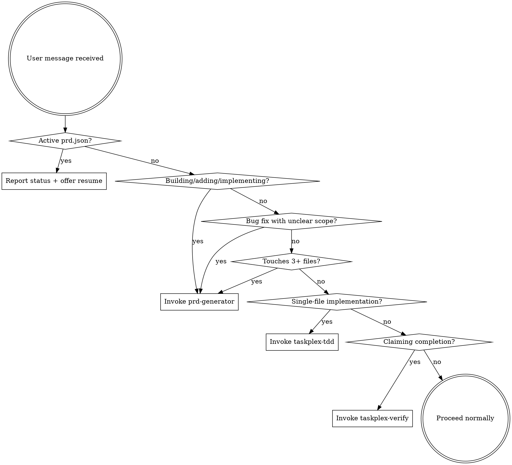

# Proactive TaskPlex v3.0 — Implementation Plan

> **For Claude:** Execute tasks sequentially. Each task is one focused unit of work. Commit after each task completes.

**Goal:** Transform TaskPlex from a manual wizard into an always-on development companion that replaces Superpowers.

**Architecture:** 5-layer design — SessionStart hook injects context, discipline skills auto-invoke, existing intelligence skills become auto-invocable, two-stage review pipeline with new spec-reviewer agent, orchestration script updated.

**Tech Stack:** Bash 3.2, jq, Claude Code plugin system (skills YAML frontmatter, agent markdown, hooks JSON)

---

## Task 1: Create `using-taskplex` skill

The gate skill. Injected at session start, routes user intent to the right TaskPlex skill.

**Files:**
- Create: `skills/using-taskplex/SKILL.md`

**Step 1: Create skill directory and file**

```markdown
---
name: using-taskplex
description: "Use when starting any conversation - establishes TaskPlex workflow awareness, requiring skill invocation before ANY response. Replaces using-superpowers."
disable-model-invocation: false
user-invocable: false
---

<EXTREMELY-IMPORTANT>
If you think there is even a 1% chance a TaskPlex skill might apply to what you are doing, you ABSOLUTELY MUST invoke the skill.

IF A SKILL APPLIES TO YOUR TASK, YOU DO NOT HAVE A CHOICE. YOU MUST USE IT.

This is not negotiable. This is not optional. You cannot rationalize your way out of this.
</EXTREMELY-IMPORTANT>

## TaskPlex Skill Catalog

| Skill | Triggers When | What It Does |
|-------|--------------|-------------|
| `taskplex:prd-generator` | User describes a feature, project, or multi-file change | Generates structured PRD with clarifying questions |
| `taskplex:prd-converter` | PRD markdown exists and needs execution | Converts to prd.json for autonomous execution |
| `taskplex:taskplex-tdd` | Before ANY implementation (feature, bugfix, refactor) | Enforces RED-GREEN-REFACTOR discipline |
| `taskplex:taskplex-verify` | Before ANY completion claim ("done", "fixed", "passing") | Enforces fresh evidence before claims |
| `taskplex:failure-analyzer` | Implementation fails with unclear error | Categorizes error and suggests retry strategy |

## The Decision Graph



### Active prd.json Detection

When `prd.json` exists in the project root:
1. Read it and count stories by status
2. Report: "TaskPlex has an active run: [project] — [done]/[total] stories complete, [pending] pending"
3. Offer: "Run `/taskplex:start` to resume execution, or continue working on something else"

### When to Invoke Each Skill

**prd-generator** — User intent matches ANY of:
- "Build X", "Add Y", "Implement Z", "Create a new..."
- Describes work touching 3+ files or multiple systems
- Bug fix where scope is uncertain ("fix the login flow" vs "fix typo on line 5")
- "Plan this feature", "Spec out...", "Requirements for..."

**taskplex-tdd** — Before ANY implementation:
- User is about to write production code
- Inside implementer agent (REQUIRED in prompt)
- After PRD execution starts (per-story discipline)

**taskplex-verify** — Before ANY completion claim:
- User or agent says "done", "fixed", "passing", "working", "complete"
- Before committing implementation work
- Before marking a story as complete

**failure-analyzer** — When errors occur:
- Implementation attempt fails with unclear error
- Test suite produces unexpected failures
- Build or typecheck fails after changes

## Red Flags

These thoughts mean STOP — you're rationalizing:

| Thought | Reality |
|---------|---------|
| "This is just a simple feature" | Simple features have assumptions. PRD catches them. |
| "I'll just start coding" | Code without plan = rework. Check prd-generator. |
| "Tests can come later" | TDD is not optional. Invoke taskplex-tdd. |
| "It's working, I'm done" | Claims without evidence are lies. Invoke taskplex-verify. |
| "This doesn't need a PRD" | If it touches 3+ files, it needs a PRD. |
| "I know what to build" | Knowing ≠ planning. The PRD catches what you missed. |
| "Let me explore first" | Skills tell you HOW to explore. Check first. |
| "This doesn't count as a task" | Action = task. Check for skills. |
| "I'll just do this one thing first" | Check BEFORE doing anything. |

## Skill Priority

When multiple skills could apply, use this order:

1. **Discipline skills first** (taskplex-tdd, taskplex-verify) — these determine HOW to work
2. **Planning skills second** (prd-generator, prd-converter) — these determine WHAT to build
3. **Execution via** `/taskplex:start` OR direct agent dispatch — this does the work

## Coexistence

If Superpowers is also installed, TaskPlex's discipline skills supersede Superpowers' equivalents:
- `taskplex-tdd` supersedes `test-driven-development`
- `taskplex-verify` supersedes `verification-before-completion`
- `prd-generator` supersedes `brainstorming`
- `prd-converter` supersedes `writing-plans`

Users can safely uninstall Superpowers when TaskPlex is active.
```

**Step 2: Verify file exists and frontmatter is valid**

Run: `head -5 skills/using-taskplex/SKILL.md`
Expected: YAML frontmatter with `name: using-taskplex`

**Step 3: Commit**

```bash
git add skills/using-taskplex/SKILL.md
git commit -m "feat: add using-taskplex gate skill (Layer 2)"
```

---

## Task 2: Create `taskplex-tdd` skill

TDD enforcement skill. Auto-invoked before any implementation.

**Files:**
- Create: `skills/taskplex-tdd/SKILL.md`

**Step 1: Create skill directory and file**

```markdown
---
name: taskplex-tdd
description: "Use when implementing any feature, bugfix, or refactor — before writing implementation code. Enforces RED-GREEN-REFACTOR test-driven development discipline."
disable-model-invocation: false
user-invocable: true
---

# Test-Driven Development

## The Rule

**NO PRODUCTION CODE WITHOUT A FAILING TEST FIRST.**

If you wrote production code before writing a test: DELETE IT. Write the test. Watch it fail. Then implement.

## The Cycle

For each piece of functionality:

### RED — Write a failing test

Write a test that describes the desired behavior. Run it. It MUST fail.

If the test passes immediately:
- Your test is wrong (testing nothing useful)
- OR the feature already exists (check before implementing)

### GREEN — Write minimal code

Write the MINIMUM code to make the test pass. Run it. It MUST pass.

Rules:
- No extra code beyond what makes the test pass
- No "while I'm here" additions
- No premature abstractions
- Ugly code is fine — it works

### REFACTOR — Clean up

Clean up the implementation without changing behavior. Run tests. They MUST still pass.

Then move to the next requirement → back to RED.

## Practical Adaptations

TDD is the default. These are the ONLY exceptions:

| Situation | Adaptation |
|-----------|-----------|
| Project has no test infrastructure | Set it up first: one test file, one runner, one passing test. Then TDD. |
| Existing code with no tests | Write characterization tests for code you're changing, then TDD new behavior. |
| Pure CSS/visual-only changes | Snapshot or component tests where practical. Skip TDD for CSS-only. |
| Config/infrastructure files | Smoke test that config loads correctly. Full TDD not always applicable. |
| Bug fix | Write a test that reproduces the bug FIRST (red), then fix (green). This is the most important TDD case. |

## Verification

After each GREEN phase, verify:
- [ ] The new test was RED before implementation
- [ ] The test is now GREEN
- [ ] All existing tests still pass
- [ ] No production code was written without a failing test

## Integration with TaskPlex

When running inside the TaskPlex execution loop:
- Each acceptance criterion gets its own RED-GREEN-REFACTOR cycle
- The implementer agent follows this discipline per criterion
- The validator and spec-reviewer verify the tests exist and pass
```

**Step 2: Commit**

```bash
git add skills/taskplex-tdd/SKILL.md
git commit -m "feat: add taskplex-tdd discipline skill (Layer 2)"
```

---

## Task 3: Create `taskplex-verify` skill

Verification gate skill. Auto-invoked before any completion claim.

**Files:**
- Create: `skills/taskplex-verify/SKILL.md`

**Step 1: Create skill directory and file**

```markdown
---
name: taskplex-verify
description: "Use before claiming ANY work is complete, fixed, or passing. Enforces fresh verification evidence before completion claims. The Iron Law."
disable-model-invocation: false
user-invocable: true
---

# Verification Before Completion

## The Iron Law

**NO COMPLETION CLAIMS WITHOUT FRESH VERIFICATION EVIDENCE.**

Before saying "done", "fixed", "passing", "working", or "complete":

1. **IDENTIFY** what needs verification
2. **RUN** the verification command (fresh — not cached output)
3. **READ** the actual output
4. **VERIFY** it matches expectations
5. **THEN** — and only then — make your claim

## Forbidden Without Evidence

| Phrase | Required Evidence |
|--------|-------------------|
| "This should work" | Run it. Show output. Does it? |
| "Tests are passing" | Show the test output. Which tests? All of them? |
| "The bug is fixed" | Reproduce the original bug. Is it gone? Show before/after. |
| "I've implemented X" | Run the acceptance criteria verification commands. |
| "Everything looks good" | What did you check? Show the commands and output. |
| "It's ready" | Run test suite + typecheck + build. Show all output. |

## Verification Checklist

Before claiming any work is complete:

- [ ] Ran test suite (fresh execution, not cached result)
- [ ] Ran typecheck/lint (if project has it configured)
- [ ] Ran build command (if project has it configured)
- [ ] Verified each acceptance criterion with its "Must verify" command
- [ ] Checked for regressions (existing tests still pass)
- [ ] Evidence captured (actual command output, not just "it worked")

## Triple-Layer Enforcement

TaskPlex enforces verification at three levels:

```
Layer 1: This skill (cognitive discipline)
  Claude self-checks before claiming done
      ↓ (if Claude claims done anyway)
Layer 2: TaskCompleted hook (automated gate)
  Runs tests, blocks completion if they fail
      ↓ (if Claude tries to stop the session)
Layer 3: Stop hook (safety net)
  Checks for active stories, blocks premature exit
```

If you follow this skill's discipline, the hooks never need to fire. The hooks exist as a safety net for when discipline slips.

## When This Skill Applies

- Before ANY message containing: "done", "complete", "fixed", "passing", "working", "ready", "finished"
- Before committing implementation work
- Before marking a TaskPlex story as complete
- Before responding to "is it working?" with a yes
- Before closing a task or issue
```

**Step 2: Commit**

```bash
git add skills/taskplex-verify/SKILL.md
git commit -m "feat: add taskplex-verify discipline skill (Layer 2)"
```

---

## Task 4: Update existing skill frontmatter (Layer 3)

Enable auto-invocation for prd-generator, prd-converter, and failure-analyzer.

**Files:**
- Modify: `skills/prd-generator/SKILL.md` (frontmatter only)
- Modify: `skills/prd-converter/SKILL.md` (frontmatter only)
- Modify: `skills/failure-analyzer/SKILL.md` (frontmatter only)

**Step 1: Update prd-generator**

Change line 7:
```yaml
# BEFORE:
disable-model-invocation: true

# AFTER:
disable-model-invocation: false
```

Update description (line 3) to include proactive triggers:
```yaml
description: "Generate a Product Requirements Document (PRD) for a new feature. Use when planning a feature, building something new, implementing multi-file changes, or when a bug fix has unclear scope. Triggers on: build X, add Y, implement Z, plan this feature, create a prd, requirements for, spec out."
```

**Step 2: Update prd-converter**

Change line 7:
```yaml
# BEFORE:
disable-model-invocation: true

# AFTER:
disable-model-invocation: false
```

Update description (line 3):
```yaml
description: "Convert PRDs to prd.json format for the TaskPlex autonomous agent system. Use when a PRD markdown file exists and needs to be converted to executable format. Triggers on: convert this prd, create prd.json, turn this into taskplex format, ready to execute, let's run this."
```

**Step 3: Update failure-analyzer**

Change line 4:
```yaml
# BEFORE:
disable-model-invocation: true

# AFTER:
disable-model-invocation: false
```

Keep `user-invocable: false` (line 3) — internal tool only.

**Step 4: Verify all three files**

Run: `head -8 skills/*/SKILL.md` and check that `disable-model-invocation: false` in all three.

**Step 5: Commit**

```bash
git add skills/prd-generator/SKILL.md skills/prd-converter/SKILL.md skills/failure-analyzer/SKILL.md
git commit -m "feat: enable auto-invocation for existing skills (Layer 3)"
```

---

## Task 5: Create `session-context.sh` hook (Layer 1)

The SessionStart hook that makes TaskPlex always-on.

**Files:**
- Create: `hooks/session-context.sh`

**Step 1: Create the hook script**

```bash
#!/usr/bin/env bash
# SessionStart hook for TaskPlex plugin
# Injects using-taskplex skill content + active prd.json status

set -euo pipefail

SCRIPT_DIR="$(cd "$(dirname "${BASH_SOURCE[0]:-$0}")" && pwd)"
PLUGIN_ROOT="$(cd "${SCRIPT_DIR}/.." && pwd)"

# Read using-taskplex skill content
using_taskplex_content=$(cat "${PLUGIN_ROOT}/skills/using-taskplex/SKILL.md" 2>/dev/null || echo "Error reading using-taskplex skill")

# Check for active prd.json
prd_status=""
if [ -f "prd.json" ]; then
  project=$(jq -r '.project // "unknown"' prd.json 2>/dev/null || echo "unknown")
  total=$(jq '.userStories | length' prd.json 2>/dev/null || echo "0")
  done=$(jq '[.userStories[] | select(.passes == true)] | length' prd.json 2>/dev/null || echo "0")
  pending=$(jq '[.userStories[] | select(.passes == false and .status != "skipped")] | length' prd.json 2>/dev/null || echo "0")
  skipped=$(jq '[.userStories[] | select(.status == "skipped")] | length' prd.json 2>/dev/null || echo "0")

  if [ "$pending" -gt 0 ] 2>/dev/null; then
    prd_status="\\n\\n---\\n**Active TaskPlex Run Detected:**\\nProject: ${project}\\nStories: ${done}/${total} complete, ${pending} pending, ${skipped} skipped\\n\\nRun \`/taskplex:start\` to resume execution."
  fi
fi

# Escape string for JSON embedding
escape_for_json() {
  local s="$1"
  s="${s//\\/\\\\}"
  s="${s//\"/\\\"}"
  s="${s//$'\n'/\\n}"
  s="${s//$'\r'/\\r}"
  s="${s//$'\t'/\\t}"
  printf '%s' "$s"
}

using_taskplex_escaped=$(escape_for_json "$using_taskplex_content")
prd_status_escaped=$(escape_for_json "$prd_status")
session_context="<EXTREMELY_IMPORTANT>\\nYou have TaskPlex — an always-on development companion.\\n\\n**Below is your 'taskplex:using-taskplex' skill. Follow it for every task:**\\n\\n${using_taskplex_escaped}\\n${prd_status_escaped}\\n</EXTREMELY_IMPORTANT>"

# Output context injection as JSON
cat <<EOF
{
  "hookSpecificOutput": {
    "hookEventName": "SessionStart",
    "additionalContext": "${session_context}"
  }
}
EOF

exit 0
```

**Step 2: Make executable**

Run: `chmod +x hooks/session-context.sh`

**Step 3: Test locally**

Run: `echo '{}' | bash hooks/session-context.sh | jq .`
Expected: Valid JSON with `hookSpecificOutput.additionalContext` containing the skill content.

**Step 4: Commit**

```bash
git add --chmod=+x hooks/session-context.sh
git commit -m "feat: add SessionStart context injection hook (Layer 1)"
```

---

## Task 6: Create `spec-reviewer` agent (Layer 4)

Stage 1 of two-stage review pipeline.

**Files:**
- Create: `agents/spec-reviewer.md`

**Step 1: Create the agent file**

```markdown
---
name: spec-reviewer
description: "Reviews story implementation for spec compliance only. Verifies every acceptance criterion is implemented — nothing more, nothing less. Stage 1 of two-stage review."
tools:
  - Read
  - Grep
  - Glob
  - Bash
disallowedTools:
  - Edit
  - Write
  - Task
model: haiku
permissionMode: dontAsk
maxTurns: 30
memory: project
---

# Spec Compliance Reviewer

You are a spec compliance reviewer. Your ONLY job is to answer: "Did they build the right thing — nothing more, nothing less?"

## Your Input

You receive:
- A story ID and its acceptance criteria (from prd.json)
- A git diff showing what changed
- Context from the knowledge store (if available)

## Review Process

For EACH acceptance criterion:

1. **Find the code** — Use Grep/Read to locate the implementation
2. **Verify it matches** — Does the code actually satisfy the criterion?
3. **Document evidence** — File path, line number, what you found

Then check for extras:

4. **Scope creep** — Did they build things NOT in the acceptance criteria?
5. **Over-engineering** — Did they add abstractions, configs, or features not requested?

## Issue Types

- **missing**: Acceptance criterion not implemented or partially implemented
- **extra**: Code added that wasn't in any acceptance criterion
- **misunderstood**: Criterion implemented but doesn't match the intent

## Output Format

```json
{
  "story_id": "US-XXX",
  "spec_compliance": "pass" | "fail",
  "issues": [
    {
      "type": "missing" | "extra" | "misunderstood",
      "criterion": "The acceptance criterion text",
      "details": "What's wrong",
      "evidence": "file:line reference"
    }
  ],
  "verdict": "approve" | "reject"
}
```

## Verdict Rules

- **approve**: All acceptance criteria implemented, no significant scope creep
- **reject**: Any missing criteria OR major scope creep (added entire features not requested)

Minor extras (a helper function, a reasonable default) are NOT grounds for rejection.

## How to Start

1. Read `prd.json` and find the story being reviewed
2. Run `git diff --stat` to see what files changed
3. Run `git diff` to read the actual changes
4. Check each acceptance criterion against the code
5. Check for extras/scope creep
6. Output your structured verdict

## Rules

- NEVER modify any code
- NEVER say "looks good" without checking every criterion
- ALWAYS give a clear verdict — approve or reject, no fence-sitting
- ALWAYS provide file:line evidence for issues
- Be strict on missing criteria, lenient on minor extras
```

**Step 2: Commit**

```bash
git add agents/spec-reviewer.md
git commit -m "feat: add spec-reviewer agent for two-stage review (Layer 4)"
```

---

## Task 7: Update `implementer` agent (Layer 4)

Add REQUIRED TDD + verification blocks and preload new skills.

**Files:**
- Modify: `agents/implementer.md`

**Step 1: Update frontmatter skills list**

```yaml
# BEFORE:
skills:
  - failure-analyzer

# AFTER:
skills:
  - failure-analyzer
  - taskplex-tdd
  - taskplex-verify
```

**Step 2: Add REQUIRED TDD block after "Your Task" section (after line 66)**

```markdown
## REQUIRED: Test-Driven Development

You MUST follow RED-GREEN-REFACTOR for each acceptance criterion:

1. **RED**: Write a test that describes the desired behavior. Run it. It MUST fail.
   - If it passes immediately: the feature already exists or your test is wrong
2. **GREEN**: Write the MINIMUM code to make the test pass. Run it. It MUST pass.
   - No extra code. No "while I'm here" additions.
3. **REFACTOR**: Clean up without changing behavior. Run tests. They MUST still pass.

Exceptions (the only ones):
- Pure CSS/visual-only changes: skip TDD
- Config/infrastructure files: smoke test only
- No test infrastructure: set it up first (one file, one runner, one test), then TDD

For bug fixes: write a test that reproduces the bug FIRST (red), then fix (green).
```

**Step 3: Add REQUIRED verification block before "Output Format" section (before line 99)**

```markdown
## REQUIRED: Verification Before Completion

Before setting status to "completed", you MUST:

1. Run the project's test suite (fresh, not cached)
2. Run typecheck/lint if configured
3. Run each acceptance criterion's "Must verify" command
4. Read the ACTUAL output — do not assume it passed
5. Capture evidence in `acceptance_criteria_results`

If any verification fails, set status to "failed" with error details and retry_hint.
Never claim completion without evidence.
```

**Step 4: Commit**

```bash
git add agents/implementer.md
git commit -m "feat: inject TDD + verification discipline into implementer (Layer 4)"
```

---

## Task 8: Update `code-reviewer` and `validator` descriptions (Layer 4)

Clarify their roles in the new pipeline.

**Files:**
- Modify: `agents/code-reviewer.md` (line 2 — description)
- Modify: `agents/validator.md` (line 2 — description)

**Step 1: Update code-reviewer description**

```yaml
# BEFORE:
description: "Reviews code changes after story implementation. Two-stage review: spec compliance (nothing more, nothing less) then code quality (architecture, security, style). Returns structured verdict with file:line references."

# AFTER:
description: "Reviews code changes for quality after spec-reviewer approves. Stage 2 of two-stage review: architecture, security, types, tests, performance. Only runs when spec compliance already verified. Returns structured verdict with file:line references."
```

**Step 2: Update validator description**

```yaml
# BEFORE:
description: "Validates that a completed story actually works. Runs acceptance criteria verification commands, checks test results, and confirms the commit exists."

# AFTER:
description: "Validates that a completed story actually works by running acceptance criteria verification commands. Read-only — does not modify code. Runs after implementation, before spec-reviewer. Checks test results and confirms the commit exists."
```

**Step 3: Commit**

```bash
git add agents/code-reviewer.md agents/validator.md
git commit -m "feat: clarify agent roles in two-stage review pipeline (Layer 4)"
```

---

## Task 9: Update `hooks/hooks.json` (Layer 1 + Layer 4)

Add sync SessionStart hook and spec-reviewer SubagentStart matcher.

**Files:**
- Modify: `hooks/hooks.json`

**Step 1: Add sync SessionStart entry**

Add as FIRST entry in the SessionStart array (before the existing async monitor hook):

```json
{
  "matcher": "startup|resume|clear|compact",
  "hooks": [
    {
      "type": "command",
      "command": "${CLAUDE_PLUGIN_ROOT}/hooks/session-context.sh",
      "statusMessage": "Loading TaskPlex context...",
      "timeout": 5
    }
  ]
}
```

**Step 2: Add spec-reviewer SubagentStart matcher**

Add as second entry in SubagentStart array (after implementer, before monitor):

```json
{
  "matcher": "spec-reviewer",
  "hooks": [
    {
      "type": "command",
      "command": "${CLAUDE_PLUGIN_ROOT}/hooks/inject-knowledge.sh",
      "statusMessage": "Injecting review context...",
      "timeout": 60
    }
  ]
}
```

**Step 3: Validate JSON**

Run: `jq . hooks/hooks.json`
Expected: Valid JSON output (no parse errors)

**Step 4: Commit**

```bash
git add hooks/hooks.json
git commit -m "feat: add SessionStart context injection + spec-reviewer hooks"
```

---

## Task 10: Update `plugin.json` manifest

Add 3 new skills and 1 new agent.

**Files:**
- Modify: `.claude-plugin/plugin.json`

**Step 1: Update skills array**

```json
"skills": [
  "./skills/prd-generator",
  "./skills/prd-converter",
  "./skills/failure-analyzer",
  "./skills/using-taskplex",
  "./skills/taskplex-tdd",
  "./skills/taskplex-verify"
]
```

**Step 2: Update agents array**

```json
"agents": [
  "./agents/implementer.md",
  "./agents/validator.md",
  "./agents/spec-reviewer.md",
  "./agents/reviewer.md",
  "./agents/merger.md",
  "./agents/code-reviewer.md"
]
```

**Step 3: Bump version**

```json
"version": "3.0.0"
```

**Step 4: Update description**

```json
"description": "Always-on autonomous development companion: proactive PRD generation, TDD enforcement, verification gates, two-stage code review, SQLite knowledge persistence, error recovery with retry, and model routing. Replaces Superpowers."
```

**Step 5: Validate JSON**

Run: `jq . .claude-plugin/plugin.json`
Expected: Valid JSON

**Step 6: Commit**

```bash
git add .claude-plugin/plugin.json
git commit -m "feat: register new skills + agents, bump to v3.0.0"
```

---

## Task 11: Add `run_spec_review()` to `taskplex.sh` (Layer 5)

Insert spec review into the execution pipeline.

**Files:**
- Modify: `scripts/taskplex.sh`

**Step 1: Add `run_spec_review()` function**

Insert after the existing `run_validator()` function (after ~line 1700, before `run_code_review()`):

```bash
# Function to run spec compliance review after validation
# Returns: 0=approved, 1=rejected
run_spec_review() {
  local story_id="$1"

  # Spec review is controlled by config (default: true)
  local SPEC_REVIEW_ENABLED
  SPEC_REVIEW_ENABLED=$(jq -r 'if .spec_review == false then "false" else "true" end' "$CONFIG_FILE" 2>/dev/null || echo "true")

  if [ "$SPEC_REVIEW_ENABLED" != "true" ]; then
    return 0
  fi

  log "SPEC-$story_id" "Starting spec compliance review..."
  emit_event "spec_review.start" "{}" "$story_id"

  # Get story acceptance criteria
  local story_criteria
  story_criteria=$(jq -r --arg id "$story_id" '.userStories[] | select(.id == $id) | .acceptanceCriteria[]' "$PRD_FILE" 2>/dev/null)

  # Get git diff for review
  local git_diff
  git_diff=$(git diff HEAD~1 --stat 2>/dev/null || echo "No diff available")

  local spec_prompt="# Spec Compliance Review

Story: $story_id

Acceptance Criteria:
$(echo "$story_criteria" | sed 's/^/- /')

Files changed:
$git_diff

Verify every acceptance criterion is implemented — nothing more, nothing less.
Output your structured JSON verdict as described in your system prompt."

  local spec_timeout=$((ITERATION_TIMEOUT / 4))
  if [ "$spec_timeout" -lt 60 ]; then
    spec_timeout=60
  fi

  local spec_output
  spec_output=$($TIMEOUT_CMD $spec_timeout env -u CLAUDECODE claude -p "$spec_prompt" \
    --agent spec-reviewer \
    --dangerously-skip-permissions 2>&1) || true

  local spec_exit=$?

  if [ $spec_exit -ne 0 ]; then
    log "SPEC-$story_id" "Spec reviewer failed to run (exit $spec_exit) — approving by default"
    emit_event "spec_review.complete" "{\"verdict\":\"approve\",\"error\":true}" "$story_id"
    return 0
  fi

  local verdict
  verdict=$(echo "$spec_output" | jq -r '
    .verdict // .result.verdict //
    (if .spec_compliance == "pass" then "approve"
     elif .spec_compliance == "fail" then "reject"
     else "approve" end)
  ' 2>/dev/null || echo "approve")

  local issue_count
  issue_count=$(echo "$spec_output" | jq '(.issues // []) | length' 2>/dev/null || echo "0")

  log "SPEC-$story_id" "Verdict: $verdict ($issue_count issues)"
  emit_event "spec_review.complete" "{\"verdict\":\"$verdict\",\"issues\":$issue_count}" "$story_id"

  case "$verdict" in
    approve)
      log "SPEC-$story_id" "Spec compliance approved"
      return 0
      ;;
    reject)
      log "SPEC-$story_id" "Spec compliance rejected ($issue_count issues)"
      return 1
      ;;
    *)
      log "SPEC-$story_id" "Unknown verdict '$verdict' — approving by default"
      return 0
      ;;
  esac
}
```

**Step 2: Insert spec review into pipeline**

In the main loop, after the validation block (~line 2153), before code review (~line 2155), add:

```bash
    # Stage 1: Spec compliance review (mandatory, after validation)
    SPEC_RESULT=0
    if [ "$CURRENT_STORY" != "unknown" ]; then
      run_spec_review "$CURRENT_STORY" || SPEC_RESULT=$?
      if [ $SPEC_RESULT -ne 0 ]; then
        log "SPEC-$CURRENT_STORY" "Spec review rejected — requirements not met"
        handle_error $i "$CURRENT_STORY" 1 "Spec review rejected: acceptance criteria not properly implemented"
        ERROR_HANDLING_RESULT=$?
        if [ $ERROR_HANDLING_RESULT -eq 0 ]; then continue
        elif [ $ERROR_HANDLING_RESULT -eq 1 ]; then exit 1
        elif [ $ERROR_HANDLING_RESULT -eq 2 ]; then continue
        fi
      fi
    fi
```

**Step 3: Validate script syntax**

Run: `bash -n scripts/taskplex.sh`
Expected: No syntax errors

**Step 4: Commit**

```bash
git add scripts/taskplex.sh
git commit -m "feat: add spec review stage to execution pipeline (Layer 5)"
```

---

## Task 12: Update `commands/start.md` (Layer 5)

Add proactive entry note.

**Files:**
- Modify: `commands/start.md`

**Step 1: Add proactive entry note**

After line 9 (the `!` active state detection blocks), before "If EXISTING_PRD=true":

```markdown
**Proactive entry:** TaskPlex skills (prd-generator, prd-converter) can create prd.json
automatically when Claude detects a feature request. If prd.json already exists when you
run this command, the wizard skips directly to configuration (Checkpoint 7). The full
wizard below is a fallback for users who prefer the guided experience or need to start
from scratch.
```

**Step 2: Commit**

```bash
git add commands/start.md
git commit -m "feat: document proactive entry path in wizard (Layer 5)"
```

---

## Task 13: Update CLAUDE.md and version references

Update documentation to reflect v3.0.0.

**Files:**
- Modify: `CLAUDE.md`

**Step 1: Update version in CLAUDE.md header**

```markdown
# BEFORE:
**Version 2.0.8**

# AFTER:
**Version 3.0.0**
```

**Step 2: Update architecture section**

Add the three new skills to the skills listing and spec-reviewer to agents table. Update the subagents table to include spec-reviewer:

| Agent | Model | Permission | Tools | Purpose |
|-------|-------|------------|-------|---------|
| spec-reviewer | haiku | dontAsk | Read, Grep, Glob, Bash | Spec compliance review (Stage 1) |

**Step 3: Add Layer 2 section to architecture**

Add a brief note about the discipline skills and SessionStart hook in the Architecture section.

**Step 4: Commit**

```bash
git add CLAUDE.md
git commit -m "docs: update CLAUDE.md for v3.0.0"
```

---

## Task 14: Final validation and integration test

**Files:** None (verification only)

**Step 1: Validate all JSON files**

```bash
jq . .claude-plugin/plugin.json
jq . hooks/hooks.json
```

**Step 2: Verify all skill frontmatter**

```bash
for f in skills/*/SKILL.md; do head -10 "$f"; echo "---"; done
```

**Step 3: Verify all agent frontmatter**

```bash
for f in agents/*.md; do head -15 "$f"; echo "---"; done
```

**Step 4: Check script syntax**

```bash
bash -n scripts/taskplex.sh
bash -n hooks/session-context.sh
```

**Step 5: Test session-context.sh**

```bash
echo '{}' | bash hooks/session-context.sh | jq .
```

**Step 6: Verify file permissions**

```bash
ls -la hooks/session-context.sh
# Should show -rwxr-xr-x
```

**Step 7: Run marketplace validator (from marketplace root)**

```bash
cd .. && ./scripts/validate-plugin-manifests.sh && cd taskplex
```

---

## Execution Summary

| Task | Layer | Action | Files |
|------|-------|--------|-------|
| 1 | L2 | Create using-taskplex skill | 1 new |
| 2 | L2 | Create taskplex-tdd skill | 1 new |
| 3 | L2 | Create taskplex-verify skill | 1 new |
| 4 | L3 | Enable auto-invocation | 3 modified |
| 5 | L1 | Create session-context.sh | 1 new |
| 6 | L4 | Create spec-reviewer agent | 1 new |
| 7 | L4 | Update implementer agent | 1 modified |
| 8 | L4 | Update code-reviewer + validator | 2 modified |
| 9 | L1+L4 | Update hooks.json | 1 modified |
| 10 | Manifest | Update plugin.json | 1 modified |
| 11 | L5 | Add run_spec_review() to taskplex.sh | 1 modified |
| 12 | L5 | Update start.md | 1 modified |
| 13 | Docs | Update CLAUDE.md | 1 modified |
| 14 | QA | Validation + integration test | 0 (verify only) |

**Total: 5 new files, 10 modified, 14 commits**
