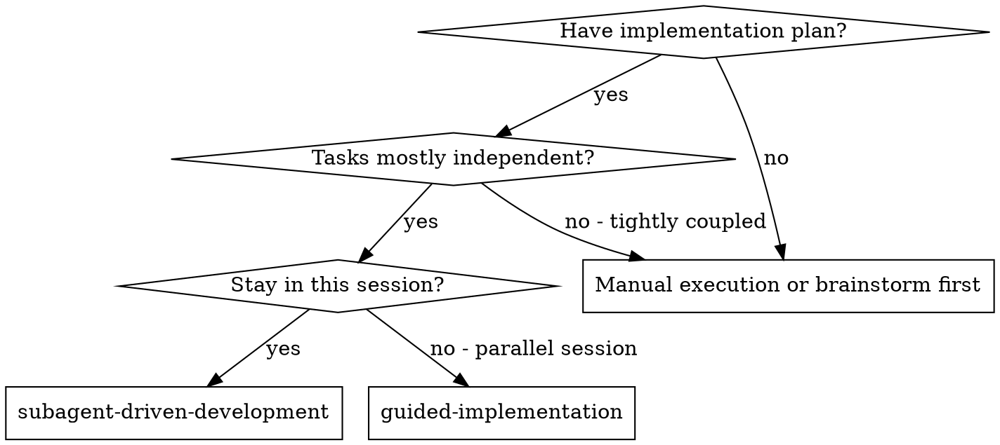
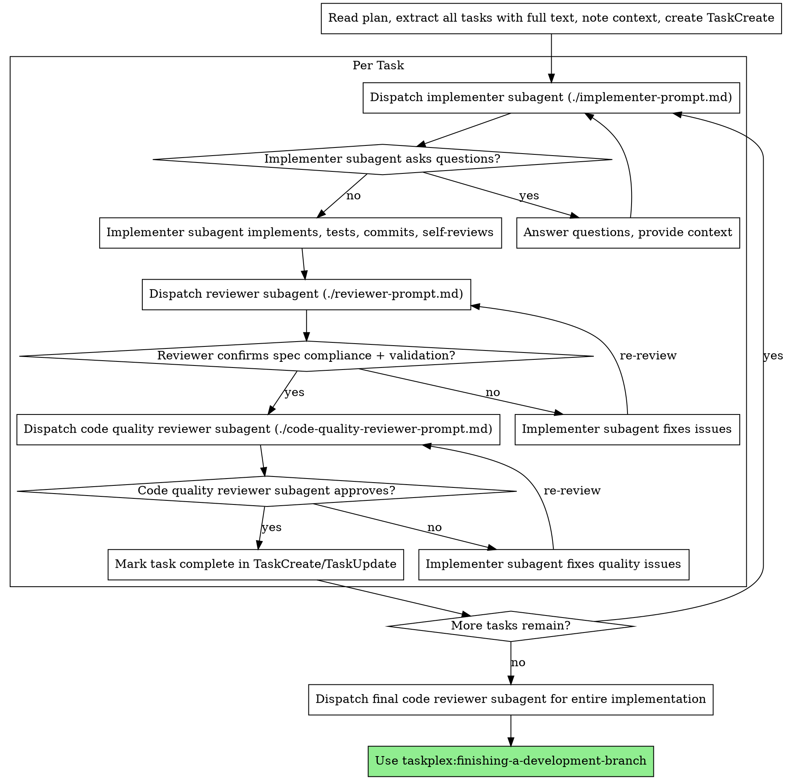

# Subagent-Driven Development

Execute plan by dispatching fresh subagent per task, with two-stage review after each: reviewer (spec + validation) first, then optional code quality review.

**Core principle:** Fresh subagent per task + two-stage review (spec+validation then quality) = high quality, fast iteration

## When to Use



**vs. Guided Implementation (parallel session):**
- Same session (no context switch)
- Fresh subagent per task (no context pollution)
- Two-stage review after each task: reviewer (spec + validation) first, then code quality
- Faster iteration (no human-in-loop between tasks)

## The Process



## Resume Logic

When resuming an interrupted run with an existing prd.json, detect and skip completed stories.

### Step 1: Detect State

```bash
jq '{
  total: (.stories | length),
  done: [.stories[] | select(.passes == true)] | length,
  skipped: [.stories[] | select(.status == "skipped")] | length,
  in_progress: [.stories[] | select(.status == "in_progress")] | length,
  pending: [.stories[] | select(.passes != true and .status != "skipped" and .status != "in_progress")] | length
}' prd.json
```

### Step 2: Skip Completed

- `passes: true` → Done. Skip entirely.
- `status: "skipped"` → Intentionally skipped. Skip.
- `status: "in_progress"` → Interrupted. Check `git log --oneline -5` for partial commits. If commits exist, dispatch reviewer first to assess state. If no commits, treat as pending.

### Step 3: Report and Continue

```
Resuming interrupted run:
- X/Y stories complete
- Z stories skipped
- Starting from: US-NNN (<story title>)
```

Start from first pending story.

### Step 4: Carry Forward Learnings

Include `learnings` from completed stories in subsequent implementer context:

```
Previous stories discovered:
- [learning from US-001]
- [learning from US-002]
```

This prevents repeated mistakes and shares codebase insights across stories.

## Prompt Templates

- `./implementer-prompt.md` - Dispatch implementer subagent
- `./reviewer-prompt.md` - Dispatch reviewer subagent (spec compliance + validation)
- `./code-quality-reviewer-prompt.md` - Dispatch code quality reviewer subagent

## Example Workflow

```
You: I'm using Subagent-Driven Development to execute this plan.

[Read plan file once: docs/plans/feature-plan.md]
[Extract all 5 tasks with full text and context]
[Create tasks with TaskCreate]

Task 1: Hook installation script

[Get Task 1 text and context (already extracted)]
[Dispatch implementation subagent with full task text + context]

Implementer: "Before I begin - should the hook be installed at user or system level?"

You: "User level (~/.config/taskplex/hooks/)"

Implementer: "Got it. Implementing now..."
[Later] Implementer:
  - Implemented install-hook command
  - Added tests, 5/5 passing
  - Self-review: Found I missed --force flag, added it
  - Committed

[Dispatch reviewer]
Reviewer: Spec: all criteria met. Validation: tests pass. Verdict: approve.

[Get git SHAs, dispatch code quality reviewer]
Code reviewer: Strengths: Good test coverage, clean. Issues: None. Approved.

[Mark Task 1 complete with TaskUpdate]

Task 2: Recovery modes
...
```

## Advantages

**vs. Manual execution:**
- Subagents follow TDD naturally
- Fresh context per task (no confusion)
- Parallel-safe (subagents don't interfere)
- Subagent can ask questions (before AND during work)

**vs. Guided Implementation:**
- Same session (no handoff)
- Continuous progress (no waiting)
- Review checkpoints automatic

**Quality gates:**
- Self-review catches issues before handoff
- Two-stage review: reviewer (spec + validation), then code quality
- Review loops ensure fixes actually work
- Spec compliance prevents over/under-building
- Code quality ensures implementation is well-built

## Red Flags

**Never:**
- Start implementation on main/master branch without explicit user consent
- Skip reviews (reviewer OR code quality)
- Proceed with unfixed issues
- Dispatch multiple implementation subagents in parallel (conflicts)
- Make subagent read plan file (provide full text instead)
- Skip scene-setting context (subagent needs to understand where task fits)
- Ignore subagent questions (answer before letting them proceed)
- Accept "close enough" on spec compliance (reviewer found issues = not done)
- Skip review loops (reviewer found issues = implementer fixes = review again)
- Let implementer self-review replace actual review (both are needed)
- **Start code quality review before reviewer approves** (wrong order)
- Move to next task while either review has open issues
- Re-implement stories that already have `passes: true` in prd.json
- Skip the resume check when prd.json already has completed stories

**If subagent asks questions:**
- Answer clearly and completely
- Provide additional context if needed
- Don't rush them into implementation

**If reviewer finds issues:**
- Implementer (same subagent) fixes them
- Reviewer reviews again
- Repeat until approved
- Don't skip the re-review

**If subagent fails task:**
- Dispatch fix subagent with specific instructions
- Don't try to fix manually (context pollution)

## Integration

**Required workflow skills:**
- **taskplex:using-git-worktrees** — REQUIRED: Set up isolated workspace before starting
- **taskplex:finishing-a-development-branch** — REQUIRED: Complete development after all tasks

**Plan sources (one of):**
- **prd.json** — Created by /taskplex:start wizard (prd-generator → prd-converter). Stories extracted directly as tasks.
- **Plan document** — Created by taskplex:writing-plans. Tasks extracted from markdown structure.

**Review templates:**
- **taskplex:requesting-code-review** — Code review template for reviewer subagents

**Subagents should use:**
- **taskplex:taskplex-tdd** — Subagents follow TDD for each task

**Alternative workflow:**
- **taskplex:guided-implementation** — Use for human-guided inline execution instead of agent dispatch
