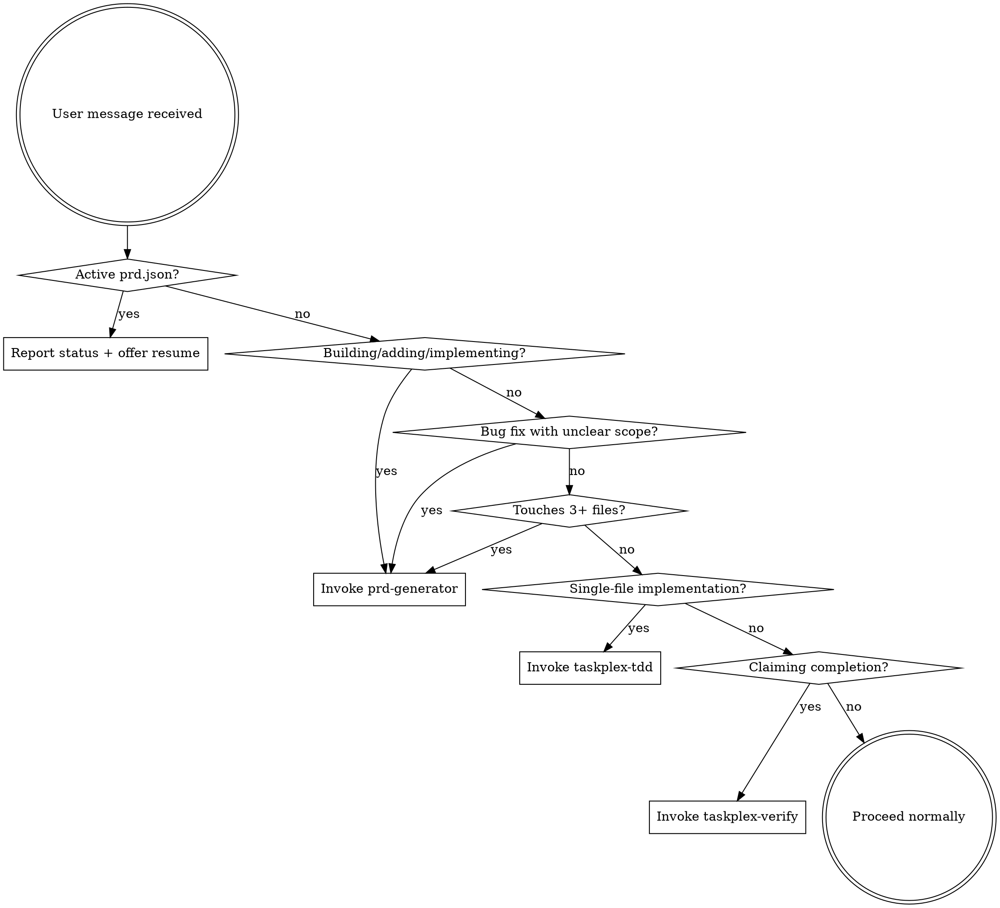

<EXTREMELY-IMPORTANT>
If you think there is even a 1% chance a TaskPlex skill might apply to what you are doing, you ABSOLUTELY MUST invoke the skill.

IF A SKILL APPLIES TO YOUR TASK, YOU DO NOT HAVE A CHOICE. YOU MUST USE IT.

This is not negotiable. This is not optional. You cannot rationalize your way out of this.
</EXTREMELY-IMPORTANT>

## TaskPlex Skill Catalog

| Skill | Triggers When | What It Does |
|-------|--------------|-------------|
| `taskplex:prd-generator` | User describes a feature, project, or multi-file change | Generates structured PRD with clarifying questions |
| `taskplex:prd-converter` | PRD markdown exists and needs execution | Converts to prd.json for autonomous execution |
| `taskplex:taskplex-tdd` | Before ANY implementation (feature, bugfix, refactor) | Enforces RED-GREEN-REFACTOR discipline |
| `taskplex:taskplex-verify` | Before ANY completion claim ("done", "fixed", "passing") | Enforces fresh evidence before claims |
| `taskplex:failure-analyzer` | Implementation fails with unclear error | Categorizes error and suggests retry strategy |

## The Decision Graph

### Active prd.json Detection

When `prd.json` exists in the project root:
1. Read it and count stories by status
2. Report: "TaskPlex has an active run: [project] — [done]/[total] stories complete, [pending] pending"
3. Offer: "Run `/taskplex:start` to resume execution, or continue working on something else"

### When to Invoke Each Skill

**prd-generator** — User intent matches ANY of:
- "Build X", "Add Y", "Implement Z", "Create a new..."
- Describes work touching 3+ files or multiple systems
- Bug fix where scope is uncertain ("fix the login flow" vs "fix typo on line 5")
- "Plan this feature", "Spec out...", "Requirements for..."

**taskplex-tdd** — Before ANY implementation:
- User is about to write production code
- Inside implementer agent (REQUIRED in prompt)
- After PRD execution starts (per-story discipline)

**taskplex-verify** — Before ANY completion claim:
- User or agent says "done", "fixed", "passing", "working", "complete"
- Before committing implementation work
- Before marking a story as complete

**failure-analyzer** — When errors occur:
- Implementation attempt fails with unclear error
- Test suite produces unexpected failures
- Build or typecheck fails after changes

## Red Flags

These thoughts mean STOP — you're rationalizing:

| Thought | Reality |
|---------|---------|
| "This is just a simple feature" | Simple features have assumptions. PRD catches them. |
| "I'll just start coding" | Code without plan = rework. Check prd-generator. |
| "Tests can come later" | TDD is not optional. Invoke taskplex-tdd. |
| "It's working, I'm done" | Claims without evidence are lies. Invoke taskplex-verify. |
| "This doesn't need a PRD" | If it touches 3+ files, it needs a PRD. |
| "I know what to build" | Knowing ≠ planning. The PRD catches what you missed. |
| "Let me explore first" | Skills tell you HOW to explore. Check first. |
| "This doesn't count as a task" | Action = task. Check for skills. |
| "I'll just do this one thing first" | Check BEFORE doing anything. |

## Skill Priority

When multiple skills could apply, use this order:

1. **Discipline skills first** (taskplex-tdd, taskplex-verify) — these determine HOW to work
2. **Planning skills second** (prd-generator, prd-converter) — these determine WHAT to build
3. **Execution via** `/taskplex:start` OR direct agent dispatch — this does the work

## Coexistence

If Superpowers is also installed, TaskPlex's discipline skills supersede Superpowers' equivalents:
- `taskplex-tdd` supersedes `test-driven-development`
- `taskplex-verify` supersedes `verification-before-completion`
- `prd-generator` supersedes `brainstorming`
- `prd-converter` supersedes `writing-plans`

Users can safely uninstall Superpowers when TaskPlex is active.
