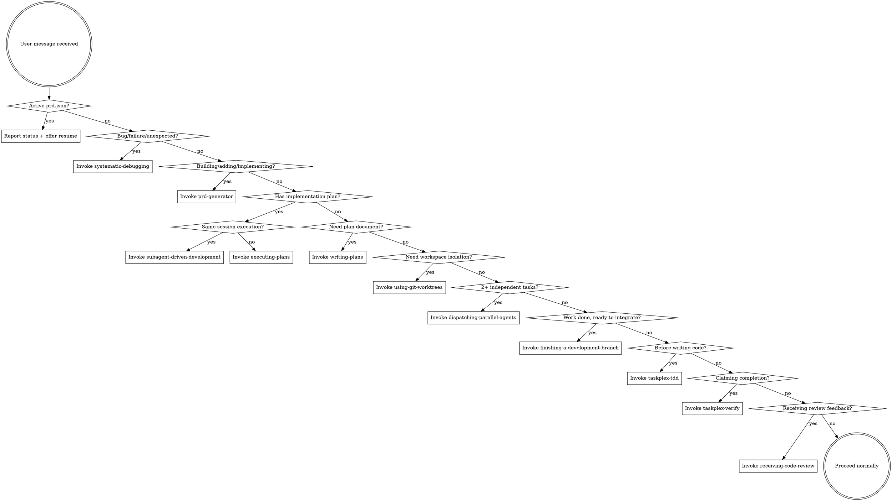

<EXTREMELY-IMPORTANT>
If you think there is even a 1% chance a TaskPlex skill might apply to what you are doing, you ABSOLUTELY MUST invoke the skill.

IF A SKILL APPLIES TO YOUR TASK, YOU DO NOT HAVE A CHOICE. YOU MUST USE IT.

This is not negotiable. This is not optional. You cannot rationalize your way out of this.
</EXTREMELY-IMPORTANT>

## TaskPlex Skill Catalog

| Skill | Triggers When | What It Does |
|-------|--------------|-------------|
| `taskplex:prd-generator` | User describes a feature, project, or multi-file change | Generates structured PRD with clarifying questions |
| `taskplex:prd-converter` | PRD markdown exists and needs execution as JSON | Converts PRD to prd.json for autonomous execution |
| `taskplex:writing-plans` | Need a detailed task-by-task implementation plan | Creates bite-sized plan doc with TDD steps and exact commands |
| `taskplex:taskplex-tdd` | Before ANY implementation (feature, bugfix, refactor) | Enforces RED-GREEN-REFACTOR discipline |
| `taskplex:taskplex-verify` | Before ANY completion claim ("done", "fixed", "passing") | Enforces fresh evidence before claims |
| `taskplex:systematic-debugging` | Any bug, test failure, or unexpected behavior | 4-phase root cause investigation before fixes |
| `taskplex:dispatching-parallel-agents` | 2+ independent tasks with no shared state | One agent per problem domain, concurrent execution |
| `taskplex:using-git-worktrees` | Starting feature work that needs isolation | Creates isolated git worktree with safety verification |
| `taskplex:finishing-a-development-branch` | Implementation complete, tests pass, ready to integrate | Verify tests, present options, execute, cleanup |
| `taskplex:requesting-code-review` | After task completion or before merge | Dispatches code-reviewer agent with SHA range |
| `taskplex:receiving-code-review` | Receiving code review feedback | Technical evaluation, not performative agreement |
| `taskplex:subagent-driven-development` | Executing plan with independent tasks in current session | Fresh subagent per task + two-stage review |
| `taskplex:executing-plans` | Executing plan in separate/parallel session | Batch execution with architect review checkpoints |
| `taskplex:writing-skills` | Creating or editing skills | TDD applied to process documentation |
| `taskplex:failure-analyzer` | Implementation fails with unclear error | Categorizes error and suggests retry strategy |

## The Decision Graph

```dot
digraph taskplex_routing {
    "User message received" [shape=doublecircle];
    "Active prd.json?" [shape=diamond];
    "Report status + offer resume" [shape=box];
    "Bug/failure/unexpected?" [shape=diamond];
    "Invoke systematic-debugging" [shape=box];
    "Building/adding/implementing?" [shape=diamond];
    "Invoke prd-generator" [shape=box];
    "Has implementation plan?" [shape=diamond];
    "Same session execution?" [shape=diamond];
    "Invoke subagent-driven-development" [shape=box];
    "Invoke executing-plans" [shape=box];
    "Need plan document?" [shape=diamond];
    "Invoke writing-plans" [shape=box];
    "Need workspace isolation?" [shape=diamond];
    "Invoke using-git-worktrees" [shape=box];
    "2+ independent tasks?" [shape=diamond];
    "Invoke dispatching-parallel-agents" [shape=box];
    "Work done, ready to integrate?" [shape=diamond];
    "Invoke finishing-a-development-branch" [shape=box];
    "Before writing code?" [shape=diamond];
    "Invoke taskplex-tdd" [shape=box];
    "Claiming completion?" [shape=diamond];
    "Invoke taskplex-verify" [shape=box];
    "Receiving review feedback?" [shape=diamond];
    "Invoke receiving-code-review" [shape=box];
    "Proceed normally" [shape=doublecircle];

    "User message received" -> "Active prd.json?";
    "Active prd.json?" -> "Report status + offer resume" [label="yes"];
    "Active prd.json?" -> "Bug/failure/unexpected?" [label="no"];
    "Bug/failure/unexpected?" -> "Invoke systematic-debugging" [label="yes"];
    "Bug/failure/unexpected?" -> "Building/adding/implementing?" [label="no"];
    "Building/adding/implementing?" -> "Invoke prd-generator" [label="yes"];
    "Building/adding/implementing?" -> "Has implementation plan?" [label="no"];
    "Has implementation plan?" -> "Same session execution?" [label="yes"];
    "Same session execution?" -> "Invoke subagent-driven-development" [label="yes"];
    "Same session execution?" -> "Invoke executing-plans" [label="no"];
    "Has implementation plan?" -> "Need plan document?" [label="no"];
    "Need plan document?" -> "Invoke writing-plans" [label="yes"];
    "Need plan document?" -> "Need workspace isolation?" [label="no"];
    "Need workspace isolation?" -> "Invoke using-git-worktrees" [label="yes"];
    "Need workspace isolation?" -> "2+ independent tasks?" [label="no"];
    "2+ independent tasks?" -> "Invoke dispatching-parallel-agents" [label="yes"];
    "2+ independent tasks?" -> "Work done, ready to integrate?" [label="no"];
    "Work done, ready to integrate?" -> "Invoke finishing-a-development-branch" [label="yes"];
    "Work done, ready to integrate?" -> "Before writing code?" [label="no"];
    "Before writing code?" -> "Invoke taskplex-tdd" [label="yes"];
    "Before writing code?" -> "Claiming completion?" [label="no"];
    "Claiming completion?" -> "Invoke taskplex-verify" [label="yes"];
    "Claiming completion?" -> "Receiving review feedback?" [label="no"];
    "Receiving review feedback?" -> "Invoke receiving-code-review" [label="yes"];
    "Receiving review feedback?" -> "Proceed normally" [label="no"];
}
```

### Active prd.json Detection

When `prd.json` exists in the project root:
1. Read it and count stories by status
2. Report: "TaskPlex has an active run: [project] — [done]/[total] stories complete, [pending] pending"
3. Offer: "Run `/taskplex:start` to resume execution, or continue working on something else"

### When to Invoke Each Skill

**systematic-debugging** — Before proposing ANY fix:
- Test failure, bug report, unexpected behavior
- ESPECIALLY when "just one quick fix" seems obvious
- After 2+ failed fix attempts

**prd-generator** — User intent matches ANY of:
- "Build X", "Add Y", "Implement Z", "Create a new..."
- Describes work touching 3+ files or multiple systems
- Bug fix where scope is uncertain ("fix the login flow" vs "fix typo on line 5")
- "Plan this feature", "Spec out...", "Requirements for..."

**writing-plans** — Need detailed implementation plan:
- Have requirements/spec, need task-by-task plan
- Before subagent-driven-development or executing-plans
- When user says "plan this", "write an impl plan", "break this down into tasks"

**subagent-driven-development** — Executing plan in current session:
- Have an implementation plan with independent tasks
- Want fresh context per task (no pollution)
- Want two-stage review (spec then quality)

**executing-plans** — Executing plan in separate session:
- Have a plan, want batch execution with checkpoints
- Architect review between batches

**dispatching-parallel-agents** — Multiple independent problems:
- 3+ test files failing with different root causes
- Multiple subsystems broken independently
- No shared state between investigations

**using-git-worktrees** — Need isolated workspace:
- Starting feature work
- Before executing implementation plans
- When current workspace has uncommitted changes

**finishing-a-development-branch** — Work is done:
- All tests pass, implementation complete
- Ready to merge, create PR, or decide what to do with branch

**requesting-code-review** — After completing work:
- After each task in subagent-driven development
- After completing major feature
- Before merge to main

**receiving-code-review** — Processing feedback:
- Received code review comments
- Feedback seems unclear or technically questionable
- External reviewer suggestions

**taskplex-tdd** — Before ANY implementation:
- User is about to write production code
- Inside implementer agent (REQUIRED in prompt)
- After PRD execution starts (per-story discipline)

**taskplex-verify** — Before ANY completion claim:
- User or agent says "done", "fixed", "passing", "working", "complete"
- Before committing implementation work
- Before marking a story as complete

**failure-analyzer** — When errors occur:
- Implementation attempt fails with unclear error
- Test suite produces unexpected failures
- Build or typecheck fails after changes

**writing-skills** — Creating or modifying skills:
- Building new skill for this or another plugin
- Editing existing skill content
- Verifying skills work before deployment

## Red Flags

These thoughts mean STOP — you're rationalizing:

| Thought | Reality |
|---------|---------|
| "This is just a simple feature" | Simple features have assumptions. PRD catches them. |
| "I'll just start coding" | Code without plan = rework. Check prd-generator. |
| "Tests can come later" | TDD is not optional. Invoke taskplex-tdd. |
| "It's working, I'm done" | Claims without evidence are lies. Invoke taskplex-verify. |
| "This doesn't need a PRD" | If it touches 3+ files, it needs a PRD. |
| "I know what to build" | Knowing ≠ planning. The PRD catches what you missed. |
| "Let me try a quick fix" | Systematic debugging required. Root cause first. |
| "I'll review at the end" | Review after EACH task, not at the end. |
| "Tests pass, ship it" | Use finishing-a-development-branch for proper integration. |
| "I'll do it all in sequence" | Independent tasks → dispatch parallel agents. |
| "The reviewer is wrong" | Use receiving-code-review — verify before dismissing. |
| "Let me explore first" | Skills tell you HOW to explore. Check first. |
| "This doesn't count as a task" | Action = task. Check for skills. |
| "I'll just do this one thing first" | Check BEFORE doing anything. |

## Skill Priority

When multiple skills could apply, use this order:

1. **Debugging first** (systematic-debugging) — find root cause before anything
2. **Discipline skills** (taskplex-tdd, taskplex-verify, receiving-code-review) — HOW to work
3. **Planning skills** (prd-generator, prd-converter, writing-plans) — WHAT to build
4. **Execution skills** (subagent-driven-development, executing-plans, dispatching-parallel-agents) — DO the work
5. **Integration skills** (requesting-code-review, finishing-a-development-branch, using-git-worktrees) — wrap up

## Coexistence

TaskPlex includes adapted versions of all 14 Superpowers skills (MIT licensed, by Jesse Vincent).
If both plugins are installed, TaskPlex's versions take precedence.
Users can safely uninstall Superpowers when TaskPlex is active — all 14 skills have TaskPlex equivalents.
